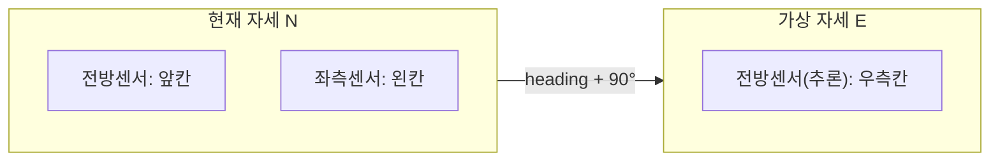
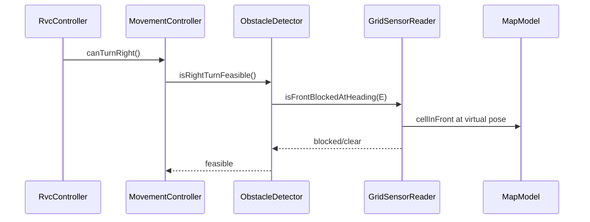

# 우측 센서 제거 대응 계획 (Virtual-Front 추론)

## 배경·문제

현재 구현은 **우측 센서가 있는 것처럼** `MapModel` 지형 정보에 직접 접근합니다.

| 위치 | 현재 동작 | 문제 |
|------|-----------|------|
| [`ObstacleDetector::isRightTurnFeasible()`](src/rvc/ObstacleDetector.cpp) | `cellToRight()` + `isObstacle()` 직접 조회 | 우측 센서 HW 제거와 불일치 |
| [`MapModel::isSurrounded()`](src/rvc/MapModel.cpp) | 전방·좌·**우** 3방향을 지형에서 직접 조회 | 우측도 동일 문제 |

제어 흐름(`canTurnRight` → `turnRight`/`turnLeft`)과 SD 시퀀스는 **변경하지 않습니다**. [`RvcController::doTurnOnce()`](src/rvc/RvcController.cpp) 및 UR-001 규칙은 그대로 유지합니다.

## 핵심 아이디어 (사용자 선택: A)

격자 기반 RVC에서 **우측 1칸**은 현재 위치에서 **우회전한 자세의 전방 1칸**과 동일합니다.



- **전방**: 현재 `heading`의 `cellInFront()`
- **좌측**: 현재 `heading`의 `cellToLeft()`
- **우측(추론)**: `turnRight(heading)` 자세에서의 `cellInFront()` — 우측 센서 없이 전방 센서 capability만 사용

이 방식은 기존 단위 테스트·ST 시나리오와 **수학적으로 동치**이므로 [`ST-003`](System-Test/scenarios/ST-003.json)(우회전), [`ST-004`](System-Test/scenarios/ST-004.json)(좌회전) 등 기대 경로를 유지할 수 있습니다.

## 아키텍처 변경

### 1. 센서 읽기 계층 도입 (NFR-003 / DEF-001 대응)

[`MapModel`](include/rvc/MapModel.hpp)은 **환경 지형(ground truth)** 과 RVC pose만 담당하고, **감지**는 별도 계층으로 분리합니다.

```
MapModel (환경·pose)
    ↑
GridSensorReader (구현체, sim용)
    ↑ implements
ISensorReader (신규 인터페이스)
    - isFrontBlocked()
    - isLeftBlocked()
    - isFrontBlockedAtHeading(Direction)  // virtual-pose front
    ↑ used by
ObstacleDetector (IObstacleDetector 구현)
```

- **공개 API 변경 최소화**: [`IObstacleDetector`](include/rvc/IObstacleDetector.hpp)의 `isRightTurnFeasible()` 시그니처는 DCD·traceability와 일치하므로 **유지**
- `GridSensorReader`는 시뮬레이터용 구현으로 `MapModel`을 참조해 전방·좌측 센서 값을 반환 (향후 HW 드라이버로 교체 가능)

### 2. `ObstacleDetector` 리팩터링

[`ObstacleDetector.cpp`](src/rvc/ObstacleDetector.cpp) 변경:

```cpp
// 의사코드
bool ObstacleDetector::isRightTurnFeasible() const {
    Direction rightHeading = turnRight(map_.rvcHeading());
    return sensor_.isFrontBlockedAtHeading(rightHeading) == false;
    // out-of-bounds → false (기존과 동일)
}
```

- `map_.cellToRight()` + `map_.isObstacle()` **직접 호출 제거**
- 우측 판단은 전방 센서 capability + 자세 변환만 사용

### 3. `isSurrounded()` 우측 판단 통합

[`MapModel::isSurrounded()`](src/rvc/MapModel.cpp)의 우측 분기도 동일 추론을 사용해야 FR-004·포위 감지가 일관됩니다.

**권장 (최소 침습):**

- `ObstacleDetector`에 `isSurrounded()` 추가 (또는 `IEnvironmentSensor` 헬퍼) — 내부에서 `sensor_.isFrontBlocked()`, `sensor_.isLeftBlocked()`, `sensor_.isFrontBlockedAtHeading(turnRight(...))` 조합
- 호출부 교체:
  - [`SimulationEngine::detectEnvironmentEvent()`](src/rvc/SimulationEngine.cpp)
  - [`RvcController::stepManeuver()`](src/rvc/RvcController.cpp)
  - [`SimulatorApp.cpp`](sim/SimulatorApp.cpp) 디버그 로그
- `MapModel::isSurrounded()`는 deprecated 래퍼로 남기거나 제거 (테스트 1곳: [`simulation_engine_test.cpp`](test/simulation_engine_test.cpp))

### 4. 의존성 주입 갱신

[`SimulationEngine`](include/rvc/SimulationEngine.hpp) 구성:

```
MapModel → GridSensorReader → ObstacleDetector(sensorReader) → RvcController
```

기존 `ObstacleDetector(const MapModel&)` 생성자를 `ObstacleDetector(ISensorReader&)`로 변경하고, 테스트 fixture에서도 동일하게 구성합니다.

## 변경 파일 요약

| 파일 | 변경 내용 |
|------|-----------|
| `include/rvc/ISensorReader.hpp` (신규) | 전방·좌측·virtual-front 읽기 인터페이스 |
| `include/rvc/GridSensorReader.hpp` + `src/rvc/GridSensorReader.cpp` (신규) | MapModel 기반 sim 센서 구현 |
| `include/rvc/ObstacleDetector.hpp` + `.cpp` | virtual-front 추론, `isSurrounded()` 추가 |
| `src/rvc/SimulationEngine.cpp` | surrounded 감지를 detector 경유 |
| `src/rvc/RvcController.cpp` | `map_.isSurrounded()` → detector |
| `sim/SimulatorApp.cpp` | 디버그 표시 정합 |
| `CMakeLists.txt` | 신규 소스 추가 |
| `test/*` | 추론 전용 테스트 추가, 기존 FR/NFR 테스트 통과 확인 |

**변경하지 않는 것:** `RvcController` 회피 시퀀스, `MovementController.canTurnRight()` API, System test JSON 기대 경로, OOD 문서(DCD public API 유지).

## 테스트 계획

### 기존 회귀 (반드시 전부 통과)

- [`test/movement_controller_test.cpp`](test/movement_controller_test.cpp) — `CanTurnRight_FR003_UR001`, `ObstacleDetectorInterface_NFR003`
- [`test/rvc_controller_test.cpp`](test/rvc_controller_test.cpp) — `HandleObstacleTurnRight/Left`, `HandleSurrounded*`
- [`test/simulation_engine_test.cpp`](test/simulation_engine_test.cpp) — obstacle/surrounded trigger
- System test ST-003, ST-004, ST-005

### 신규 단위 테스트 (추론 검증)

| 테스트 | 검증 내용 |
|--------|-----------|
| `RightInferredViaVirtualFront_FR003` | (2,2) N, 장애물 (3,2) → `isRightTurnFeasible()==false` (우측 센서 없이) |
| `SurroundedUsesInferredRight_FR004` | 전·좌·우(추론) 모두 막힘 → `isSurrounded()==true` |
| `SensorReaderOnlyFrontLeft_NFR003` | `GridSensorReader`가 전방·좌측·virtual-front만 노출, 우측 직접 API 없음 |

WSL에서 `ctest` 실행, 변경 범위 커버리지 90%+ 목표 ([`gtest-framework.mdc`](.cursor/rules/gtest-framework.mdc)).

## 검증 흐름



## 리스크·주의사항

- **OOA/OOD 문서**: OOI 스킬상 구현 단계에서 OOD 수정은 금지. 요구사항 변경(DEF-001 활성화·센서 구성 변경)은 별도로 [`docs/OOA/01-System-Requirements.md`](docs/OOA/01-System-Requirements.md)에 반영하는 것이 좋으나, **이번 구현 범위 밖**으로 분리
- **실 HW 어댑터**: sim은 pose 기하로 즉시 판단 가능. 실제 로봇에서는 동일 `ISensorReader` 인터페이스 뒤에 “우회전 후 전방 센서 1회 읽기” HW 어댑터를 둘 수 있음 (제어 SW 관점 API 동일)
- **범위 통제**: 먼지 감지(`DustDetector`), 전방 단독 감지(`isFrontBlocked`)는 이번 변경의 직접 대상이 아님. 다만 `isSurrounded`만 detector로 이전

## 완료 기준

1. `ObstacleDetector`·surrounded 경로에서 `cellToRight()` / 우측 직접 조회 **0건**
2. 기존 FR-003/004·UR-001 관련 gtest 및 ST-003~005 **전부 통과**
3. 신규 추론 테스트 2~3건 추가
4. 시뮬레이터 빌드·실행 정상, 디버그 로그에 추론 기반 surrounded 표시
