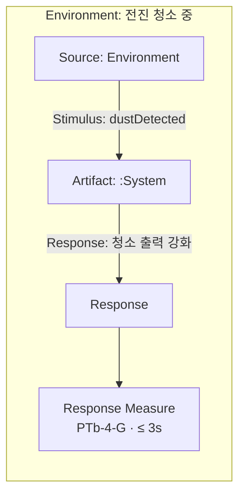
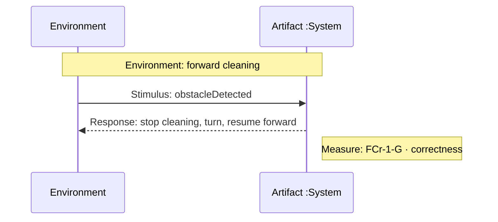
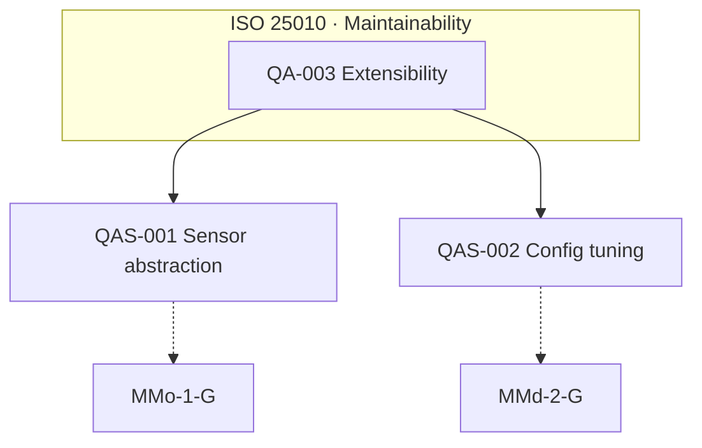

# OOA 1단계: Quality Attribute · QAS

`docs/OOA/01-System-Requirements.md`의 **FR·NFR·보류·해결결정**만 근거로 **Quality Attribute(QA)** 를 식별하고, **QAS** 를 작성한다. 임의 추가 금지.

**입력(필수):** `docs/OOA/01-System-Requirements.md` (없으면 중단)

**입력(선택):** `docs/Preliminary-Requirements.md` — 01 문서와 충돌 시 **01 우선**

**산출:** `docs/OOA/03-Quality-Attribute-Scenarios.md`

**Response Measure 참조:** [ISO-25023-Reference.md](ISO-25023-Reference.md) (ISO/IEC 25023:2016 · ISO/IEC 25010:2011 정렬)

---

## 분석 항목

| # | 할 일 | 이유 |
|---|--------|------|
| 1 | **QA 카탈로그** — NFR·FR 수용기준·보류에서 품질 관심사 추출, ISO 25010 characteristic/subcharacteristic 매핑 | 아키텍처·설계 결정의 품질 축 명시 |
| 2 | **QAS 작성** — QA마다 1건 이상 시나리오(6요소) | 이해관계자·검증 관점의 구체적 품질 요구 |
| 3 | **QAS 다이어그램** — 개요·시나리오별 Mermaid (아래 규칙) | 6요소 관계를 시각적으로 검토·공유 |
| 4 | **Response Measure** — ISO 25023 measure ID·이름·측정함수·목표값·검증방법 | 정량·반정량 검증 가능성 |
| 5 | **추적성** — FR/NFR/DEF/UR → QA → QAS → ISO 25023 | 출처 없는 항목 금지 |
| 6 | **미적용 QA** — 요구에 근거 없는 ISO 25010 특성은 **미채택**으로 기록 | 범위 밖 품질 남용 방지 |

---

## Quality Attribute 추출 규칙

1. **NFR** — 범주·요구·검증방법에서 QA 후보를 먼저 수집한다.
2. **FR** — 기능 자체가 아니라 **품질에 대한 암시**(시간·정확성·안전·확장 등)만 QA로 승격한다.
3. **보류(DEF)** — 현재 QAS 대상 아님; QA 카탈로그 **연관·확장성** 메모만.
4. **ISO 25010** — characteristic(8) · subcharacteristic 수준까지 매핑한다.
5. **중복** — 동일 품질 축은 **QA-###** 하나로 통합하고 QAS로 변형을 나눈다.

### FR/NFR → QA 매핑 힌트 (이 프로젝트)

| 출처 유형 | 흔한 ISO 25010 축 | 예 |
|-----------|-------------------|-----|
| Scope/Architecture NFR | Maintainability · Functional suitability | NFR-001, NFR-002 |
| Extensibility NFR | Maintainability (Modularity, Modifiability) | NFR-003 |
| Configurability NFR | Maintainability (Modifiability) | NFR-004 |
| 시간·지속 FR 수용기준 | Performance efficiency (Time behaviour) | FR-005 · 3초 |
| 장애물·회피 FR | Functional correctness · Reliability (Fault tolerance) | FR-003, FR-004 |
| 센서·감지 추상화 | Compatibility (Co-existence) · Maintainability | NFR-003 |

---

## QAS 6요소 (Bass · ISO 25030 정렬)

각 **QAS-###** 에 아래 6요소를 **모두** 기술한다.

| 요소 | 작성 규칙 |
|------|-----------|
| **Source** | 자극을 발생시키는 이해관계자·시스템·환경 (Operator, Maintainer, Environment, Timer 등) |
| **Stimulus** | 구체적 이벤트·조건 (예: "새 장애물 센서 타입으로 교체 요청") |
| **Artifact** | 영향 받는 부분 (`:System`, 감지 서브시스템, 설정 모듈 등 — black-box·논리 컴포넌트) |
| **Environment** | 자극 발생 시 운영 맥락 (정상 청소 중, 유지보수 모드, 시뮬레이터 등) |
| **Response** | 시스템이 수행·보여야 하는 **관측 가능** 행위·결과 |
| **Response Measure** | 아래 **ISO 25023 규칙** 준수 |

---

## QAS 다이어그램 (Mermaid)

텍스트 QAS와 **쌍**으로 다이어그램을 그린다. **QAS 1건 = 다이어그램 1개** + 문서 **개요 다이어그램 1개**.

### 다이어그램 종류

| 종류 | 위치 | 목적 |
|------|------|------|
| **개요** | §1末尾 `## 1.x QA · QAS 개요 다이어그램` | QA→QAS 관계·ISO 25010 축 한눈에 |
| **시나리오** | 각 `QAS-###` 섹션 직후 | 6요소 흐름 (Source→Stimulus→Artifact→Response→Measure) |

### 시나리오 다이어그램 규칙

1. **표기:** Mermaid `flowchart LR` (기본) 또는 `sequenceDiagram` (시간 순서가 핵심일 때).
2. **필수 노드:** Source · Stimulus(라벨) · Artifact · Response · Response Measure(Measure ID 포함).
3. **Environment:** `subgraph Environment["Environment: …"]` 로 전체를 감싸거나 `Note`로 명시.
4. **Artifact** 는 논리 컴포넌트명(`:System`, 감지 capability 등) — 구현 클래스명 금지.
5. **Response Measure** 노드에 **ISO 25023 ID + target** 요약 (예: `PTb-4-G · ≤3s`).
6. 다이어그램은 동일 QAS의 **표·텍스트와 모순 없음** — 불일치 시 표를 정본으로 맞춘다.

### 시나리오 다이어그램 예 (`flowchart LR`)



### 시나리오 다이어그램 예 (`sequenceDiagram` — 응답 시간·이벤트 순서)



### 개요 다이어그램 예 (`flowchart TD`)



- QA 노드: `QA-###` + 짧은 이름
- QAS 노드: `QAS-###` + 짧은 제목
- Measure: 점선(`-.->`)으로 QAS에 연결

---

## Response Measure — ISO/IEC 25023:2016 규칙

**필수.** 각 QAS의 Response Measure는 다음을 포함한다.

| 필드 | 내용 |
|------|------|
| **Measure ID** | ISO 25023 식별자 (예: `MMd-2-G`, `FCr-1-G`) — [ISO-25023-Reference.md](ISO-25023-Reference.md)에서 **선택** |
| **Measure name** | 표준 영문 명칭 |
| **ISO 25010** | characteristic · subcharacteristic |
| **Measurement function** | 표준 공식 요약 (QME 기호 A, B, n 등) |
| **Target value** | 프로젝트·시나리오 맥락의 **목표값·임계값** (표준은 범위를 정하지 않음 — stakeholder/도메인 근거 명시) |
| **Acceptable range** | 목표 주변 허용 범위 (해당 시) |
| **Verification** | 측정·검증 방법 (테스트, 리뷰, 프로파일링, 시뮬레이션 등) |

### 선택·작성 원칙

1. **Generic(G)** measure를 우선 사용; Specific(S)는 도메인에 명확히 해당할 때만.
2. 한 QAS에 **주 measure 1개**; 보조 measure는 **보조 Response Measure** 로 명시.
3. Reference에 없는 measure가 필요하면 **ISO 25021** QME 정의 형식으로 **사용자 정의 measure** 를 추가하고 25010 매핑·근거를 적는다.
4. 목표값은 **01-System-Requirements** 의 수용기준·UR·NFR에서 파생; 없으면 **가정(Assumption)** 으로 표시하고 stakeholder 확인 권고.
5. **내부(internal)** vs **외부(external)** measure 구분을 Verification에 명시한다.

### Response Measure 작성 예 (형식)

```markdown
- **Measure ID:** PTb-2-G
- **Name:** Response time adequacy
- **ISO 25010:** Performance efficiency · Time behaviour
- **Function:** X = 1 − A/B (A=미충족 응답 수, B=응답시간 요구 수)
- **Target:** X ≥ 1.0 (먼지 감지 후 청소 출력 강화 시작까지 ≤ 100 ms, 시뮬레이터 tick 기준)
- **Verification:** System test ST-### · tick 로그
- **근거:** FR-005, UR-003
```

---

## 산출물 형식 (`03-Quality-Attribute-Scenarios.md`)

```markdown
# Quality Attribute Scenarios (OOA 1)

## §0. 문서 개요
### 0.1 입력
### 0.2 ID · 추적 규칙 (QA-###, QAS-###, ISO 25023 measure 인용)
### 0.3 ISO 25010 · 25023 적용 범위

## §1. Quality Attribute 카탈로그
### QA-### — [이름]
| 필드 | 내용 |
| ISO 25010 characteristic | |
| ISO 25010 subcharacteristic | |
| 설명 | |
| 관련 FR/NFR/DEF/UR | |
| 출처 | |

### 1.x QA · QAS 개요 다이어그램
(mermaid flowchart — QA→QAS→Measure 관계)

## §2. Quality Attribute Scenarios (QAS)
### QAS-### — [짧은 제목]
| 필드 | 내용 |
| 관련 QA | QA-### |
| Source | |
| Stimulus | |
| Artifact | |
| Environment | |
| Response | |
| Response Measure | (ISO 25023 필드 전체) |
| 관련 FR/NFR | |
| 출처 | |

#### QAS-### Diagram
(mermaid — 6요소 흐름; Measure ID·target 표기)

## §3. 추적성 매트릭스
| FR/NFR/UR | QA | QAS | ISO 25023 Measure |

## §4. 미채택 ISO 25010 특성
| Characteristic | 미채택 사유 |

## §5. 요약
| 구분 | 건수 |
```

---

## 체크리스트

- [ ] 입력 `01-System-Requirements.md` 반영; 출처 없는 QA/QAS 없음
- [ ] 모든 QAS에 6요소 + ISO 25023 Response Measure **5필드 이상** (ID, name, function, target, verification)
- [ ] **개요 다이어그램 1개** + **QAS별 다이어그램** (6요소·Measure ID 표기)
- [ ] 다이어그램과 QAS 표 내용 **일치**
- [ ] Measure ID가 Reference 또는 사용자 정의(25010 매핑)로 정당화됨
- [ ] DEF 항목은 QAS로 승격하지 않음 (연관 메모만)
- [ ] 산출 경로: `docs/OOA/03-Quality-Attribute-Scenarios.md`

## 완료 보고

입력 문서 · 산출 경로 · QA/QAS 건수 · **다이어그램 건수(QAS+1)** · 사용한 ISO 25023 measure ID 목록 · 가정(Assumption) 요약
