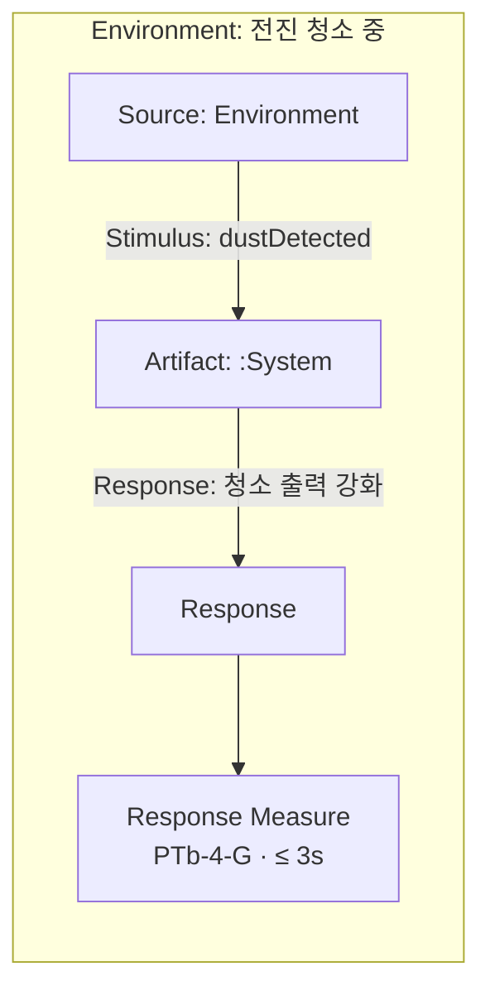

# OOA 1단계: Quality Attribute · QAS

**Plan-01**이 작성한 `docs/OOA/01-System-Requirements.md` **§0~§6** 을 근거로 **QA 카탈로그 · QAS** 를 작성하고, **동일 파일**에 §7~§8을 추가·갱신한다. 임의 추가 금지.

**입력(필수):** `docs/OOA/01-System-Requirements.md` — §2 NFR에 ISO 25010 필드 존재 (없으면 **Plan-01 선행** 후 중단)

**입력(선택):** `docs/Preliminary-Requirements.md` — §5 추적성·누락 교차 검증만; 충돌 시 **01 우선**

**산출:** `docs/OOA/01-System-Requirements.md` (**§7 · §8 추가**, §2 NFR·§5·§6 **역갱신**)

**Response Measure 참조:** [ISO-25023-Reference.md](ISO-25023-Reference.md) (ISO/IEC 25023:2016 · ISO/IEC 25010:2011)

**별도 `03-Quality-Attribute-Scenarios.md` 파일 생성 금지.**

---

## 분석 항목

| # | 할 일 | 이유 |
|---|--------|------|
| 1 | **QA 카탈로그 (§7)** — §2 NFR의 ISO 25010·FR 품질 암시를 `QA-###`로 정리 | NFR 품질축의 아키텍처 관점 명명 |
| 2 | **QAS 작성 (§8)** — QA마다 1건 이상 시나리오(6요소) | 검증 가능한 품질 시나리오 |
| 3 | **QAS 다이어그램** — §7 개요 1개 + QAS별 Mermaid | 6요소 관계 시각화 |
| 4 | **Response Measure** — ISO 25023 measure·target·verification | 정량·반정량 검증 |
| 5 | **역갱신** — §2 NFR `관련 QA`·`관련 QAS`; §5 추적성·§6 요약 보강 | 단일 요구 문서 상호참조 |
| 6 | **미적용 ISO 25010** — §7 또는 §8末에 기록 | 범위 밖 품질 남용 방지 |

---

## QA 추출 규칙

1. **§2 NFR 우선** — Plan-01이 매핑한 ISO 25010을 `QA-###`의 기준으로 사용; 동일 축은 QA 하나로 통합.
2. **§1 FR** — NFR에 없는 품질 암시만 QA 후보; **새 NFR 창설 금지** (Plan-01 미반영 품질은 완료 보고에 **Plan 보강 권고**).
3. **§3 보류(DEF)** — QAS 승격 금지; QA 설명에 연관·확장성 메모만.
4. **§4 UR** — QAS Response Measure target의 **Conformance** 근거로 사용.
5. **중복** — 동일 ISO 25010 subcharacteristic은 `QA-###` 하나; 변형은 `QAS-###`으로 분리.

### NFR(§2) → QA 매핑 힌트

| NFR 유형 | QA 초점 | 예 |
|----------|---------|-----|
| Scope / Architecture | QA 생략 가능(범위 제약); QAS 대상 아님 | NFR-001, NFR-002 |
| Extensibility · Modularity | `QA-###` Maintainability | NFR-003 |
| Configurability · Modifiability | `QA-###` Maintainability | NFR-004 |
| FR 연계 품질 NFR | Functional correctness · Time behaviour 등 | FR-003~005 연계 NFR |

---

## QAS 6요소 (Bass · ISO 25030 정렬)

각 **QAS-###** 에 아래 6요소를 **모두** 기술한다.

| 요소 | 작성 규칙 |
|------|-----------|
| **Source** | Operator, Maintainer, Environment, Timer 등 |
| **Stimulus** | 구체적 이벤트·조건 |
| **Artifact** | `:System`, 감지 capability 등 — 구현 클래스명 금지 |
| **Environment** | 정상 청소 중, 시뮬레이터 등 |
| **Response** | 관측 가능 행위·결과 |
| **Response Measure** | ISO 25023 규칙 준수 |

각 QAS는 **관련 NFR-###** 을 반드시 명시한다.

---

## QAS 다이어그램 (Mermaid)

**QAS 1건 = 다이어그램 1개** + **§7 개요 다이어그램 1개**.

| 종류 | 위치 | 목적 |
|------|------|------|
| **개요** | §7末 `### 7.x QA · QAS 개요 다이어그램` | QA→QAS→Measure |
| **시나리오** | §8 각 `QAS-###` 직후 `#### QAS-### Diagram` | 6요소 흐름 |

### 시나리오 다이어그램 규칙

1. `flowchart LR` (기본) 또는 `sequenceDiagram` (시간 순서 핵심 시).
2. 필수: Source · Stimulus · Artifact · Response · Response Measure(ID+target).
3. Environment: `subgraph` 또는 `Note`.
4. 다이어그램 ↔ §8 표 **일치** (불일치 시 표 정본).

### 예 (`flowchart LR`)



---

## Response Measure — ISO/IEC 25023:2016

| 필드 | 내용 |
|------|------|
| **Measure ID** | [ISO-25023-Reference.md](ISO-25023-Reference.md)에서 선택 |
| **Measure name** | 표준 영문 명칭 |
| **ISO 25010** | characteristic · subcharacteristic |
| **Measurement function** | QME 공식 요약 |
| **Target value** | §4 UR · §2 NFR · FR 수용기준에서 파생 |
| **Acceptable range** | 해당 시 |
| **Verification** | internal / external 구분 |

목표값 근거 없으면 **가정(Assumption)** 표시 + stakeholder 확인 권고.

---

## 산출물 — `01-System-Requirements.md` 에 추가·갱신

### §7. Quality Attribute 카탈로그 (신규)

```markdown
## §7. Quality Attribute 카탈로그

### QA-### — [이름]
| 필드 | 내용 |
| ISO 25010 characteristic | |
| ISO 25010 subcharacteristic | |
| 설명 | |
| 관련 NFR | NFR-### |
| 관련 FR/UR | |
| 관련 QAS | QAS-###, … |
| 출처 | |

### 7.x QA · QAS 개요 다이어그램
(mermaid)
```

### §8. Quality Attribute Scenarios (신규)

```markdown
## §8. Quality Attribute Scenarios (QAS)

### QAS-### — [짧은 제목]
| 필드 | 내용 |
| 관련 QA | QA-### |
| 관련 NFR | NFR-### |
| Source | |
| Stimulus | |
| Artifact | |
| Environment | |
| Response | |
| Response Measure | (ISO 25023 전 필드) |
| 관련 FR | |
| 출처 | |

#### QAS-### Diagram
(mermaid)
```

### §2 · §5 · §6 역갱신

- **§2 NFR** 각 항목: `관련 QA` · `관련 QAS` 채움 (Scope NFR은 `—` 유지 가능).
- **§5 추적성:** 열 추가 `QA` · `QAS` · `ISO 25023` (해당 시).
- **§6 요약:** QA · QAS · 다이어그램 건수 추가.

### 미채택 ISO 25010 (§7末 또는 §8末)

```markdown
### 미채택 ISO 25010 특성
| Characteristic | 미채택 사유 |
```

---

## 체크리스트

- [ ] 입력 §0~§6(Plan-01) 반영; 출처 없는 QA/QAS 없음
- [ ] 모든 QAS: 6요소 + ISO 25023 Response Measure (ID, name, function, target, verification)
- [ ] **§7 · §8** 이 동일 `01-System-Requirements.md` 에 존재
- [ ] §2 NFR `관련 QA`·`관련 QAS` 역기입 완료
- [ ] 개요 다이어그램 1개 + QAS별 다이어그램
- [ ] 별도 `03-Quality-Attribute-Scenarios.md` **미생성**
- [ ] DEF 항목 QAS 승격 없음

## 완료 보고

입력 문서 · 산출 경로(`01-System-Requirements.md`) · QA/QAS 건수 · 다이어그램 건수(QAS+1) · ISO 25023 measure ID 목록 · §2 역갱신 NFR 건수 · 가정·Plan 보강 권고
