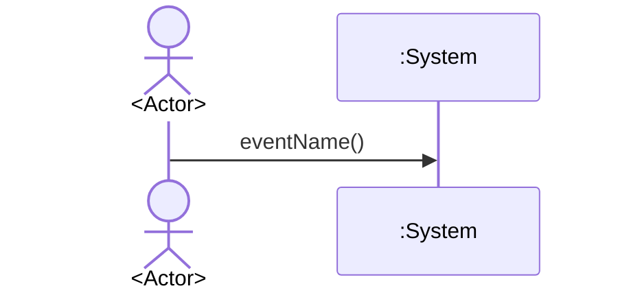

# OOA 1단계: Use Case · SSD
`docs/ooa/01-system-requirements.md`의 **FR·NFR**을 근거로 Use Case를 정의하고, **시나리오마다 SSD 1개**를 작성한다.
**입력:** `docs/OOA/01-System-Requirements.md` (필수, 없으면 중단)
**산출:** `docs/OOA/UseCases/UC-###.md`
## Use Case — 정의 · 목표 (OOAD)
| | 내용 |
|---|------|
| **정의** | Actor가 **:System** 를 사용해 목표를 달성하는 **텍스트 시나리오**. 요구를 분석하는 수단임|
| **목표** | 1단계 **FR**을 Actor 관점의 **검증 가능한, 가능한 모든 상황의 행위·상호작용**으로 재구성 |
## SSD (System Sequence Diagram) — 정의 · 목표 (OOAD)
| | 내용 |
|---|------|
| **정의** | UML **sequenceDiagram**을 **시스템 블랙박스**에 적용. **외부 Actor**가 `:System` 에 보내는 **system event**의 **순서**를 한 **시나리오**에 대해 표현한다. |
| **목표** | UC 시나리오(`UC-xx-Syy`)의 상호작용을 고정 · **system operation** 후보 도출 |
## 시나리오 ID · 파일 규칙
| 규칙 | 내용 |
|------|------|
| UC ID | `UC-###` `FR-###` (보통 n:1) |
| 시나리오 ID | `UC-##-S01`(Typical 기본 성공), `S02`…(Alternative), `S9x`(Exceptional 권장) |
| UC 문서 | `docs/OOA/UseCases/UC-###.md` |
---
## UC 문서 형식 (`UC-###.md`)
| 섹션 | 작성 규칙 |
|------|-----------|
| **Name** | `UC-###` + 짧은 영문 이름 + 한 줄 목표(한국어 가능) |
| **Actor** | Primary · Secondary(있을 때) — 표 또는 목록 |
| **Pre-Requisites** | 시나리오 시작 전 참인 조건(FR·NFR 반영) |
| **Typical Courses of Events** | **기본 성공 경로** — 번호 단계, 한 단계 = Actor 행동 **또는** 시스템 반응
하나 · 옆에 `FR-###` / `NFR-###` |
| **Alternative Courses of Events** | 정상 범주 · 시나리오 ID `UC-##-Syy` · 단계마다 FR/NFR |
| **Exceptional Courses of Events** | 실패·경계·비정상 · 다른 UC 이행 등 · `UC-##-Syy` · 단계마다 FR/NFR
|
| **시나리오 ID 요약** | `UC-##-S01` … 목록 + 대응 **SSD 파일명** (테스트·SSD 이름과 동일 규칙) |
| **Postconditions** | 시나리오 **성공** 후 관측 가능 상태 |
| **FR / NFR 추적** | Typical·Alternative·Exceptional **모든 단계**에 ID 누락 없음 |
| **Mermaid** | `flowchart` 등으로 분기 요약 · Typical/Alt/Exc 구분 |
---
## SSD - UC 파일에 같이 작성됨
```markdown
# SSD-UC-##-S##
- **UC 시나리오:** UC-##-S##
- **Actor:**
- **목적:**

| System Event | System Operation | Parameters | FR/NFR |
```

---
## 체크리스트
- [ ] Typical 최소 `S01` + Alternative/Exceptional은 FR 근거 있을 때만
- [ ] 시나리오 ID마다 SSD 1파일 · Actor·`:System` 존재
- [ ] UC 단계 순서 = SSD 메시지 순서 · 모든 단계에 FR/NFR
- [ ] Black-Box · UI-Free · 출처 없는 시나리오 없음
## 완료 보고
`01-System-Requirements` · UC 건수 · SSD(시나리오) 건수 · 경로 목록 · 미작성 SD 링크 안내