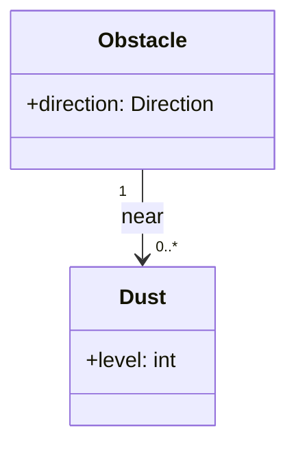

# OOA 2단계: Domain Model (Use Case 근거)

**Use Case·SSD**와 **FR·NFR**을 근거로 **Domain Model**(개념 모델)을 작성한다. 임의로 개념 추가 금지.

**입력(필수):** `docs/OOA/UseCases/UC-*.md` · `docs/OOA/01-System-Requirements.md` (없으면 중단)

**산출:** `docs/OOA/02-Domain-Model.md`

---
## Domain Model — 정의 · 목표 (OOAD)

| | 내용 |
|---|------|
| **정의** | 도메인의 **개념 클래스(conceptual class)**·**연관**·**속성**을 표현한 **도메인 어휘 사전**. UML classDiagram **표기**를 쓰지만, Class Diagram과 다르다. |
| **목표** | UC·FR이 다루는 **현실/문제 영역 개념**을 공유 |

## 분석 항목

| # | 할 일 | 이유 |
|---|--------|------|
| 1 | UC·FR 문서 **명사구** 수집 | 개념 후보 출처 |
| 2 | **개념 클래스** 선정 | 도메인 엔티티·값·역할; `:System`·Actor 이름·SW/HW 구현 타입 제외 |
| 3 | **속성** | 개념에 붙는 데이터(방향, tick, 강도 등 UC·01에 근거 있는 것만) |
| 4 | **연관** | 이름·다중성(multiplicity); 집합/구성은 의미 있을 때만 |
| 5 | **추적** | 개념 `UC-###` / `FR-###` / 시나리오 |
| 6 | **다이어그램** | Mermaid `classDiagram` — **속성만**, methods 블록 금지 |

## 포함하지 않을 것

- Software class, Controller, HAL, API, DB 테이블, UI 화면
- SuD 블랙박스 `:System` 자체를 도메인 클래스로 두지 않음(필요 시 주석)

---
## 산출물 형식 (`02-Domain-Model.md`)

```markdown
# Domain Model (OOA 2)

## 1. 입력
| 문서 | 경로 |

## 2. 요약
개념 클래스 N · 연관 M

## 3. 명사구 분석
| 출처(UC/FR) | 명사구 | 후보 | 채택 | 비고 |

## 4. 개념 클래스 목록
| 클래스 | 설명 | 속성 | 관련 UC/FR |

## 5. 연관
| 연관 | 끝1 | 다중성1 | 끝2 | 다중성2 | 설명 |

## 6. Domain Model Diagram
(mermaid classDiagram — 속성만, methods 금지)

## 7. Traceability Matrix
| UC / FR | 관련 개념 |
```

**Domain Model diagram 예시 (mermaid)**



---
## 체크리스트

- [ ] 입력 UC·01-System-Requirements 반영, 출처 없는 클래스 없음
- [ ] **메서드·operation 없음**, SW 구현 타입 없음
- [ ] UC 시나리오의 장애물·먼지·Grid·청소·회피 등이 개념으로 드러남

## 완료 보고

입력 목록 · 경로 · 클래스/연관 건수 · 미채택 명사구 1~3건(있을 때)
