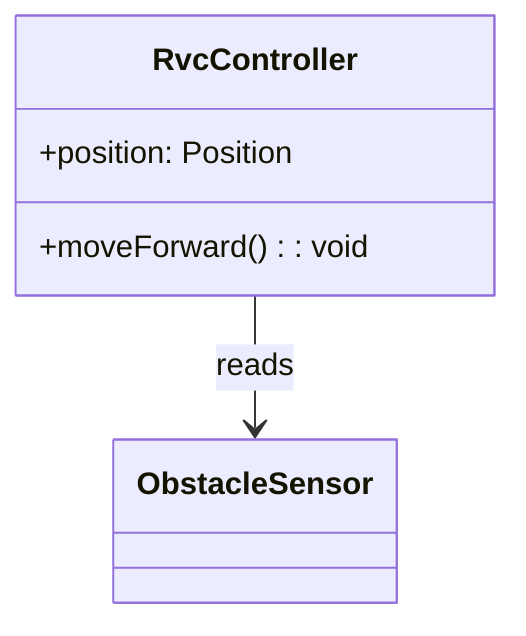

# OOD 1단계: Sequence Diagram + Design Class Diagram
**SSD system operation**을 근거로 **SD(내부 협력)** 와 **DCD(설계 클래스)** 를 **함께·반복적으로** 정의한다.
**입력(필수):** `docs/OOA/UseCases/UC-*.md` · `docs/OOA/02-Domain-Model.md` (없으면 중단)
**산출:**
- `docs/OOD/SD/SD-UC-###-S##.md` — SSD 시나리오 1개 = SD 1개
- `docs/OOD/DCD/DCD.md` — SD를 그릴 때마다 **누적·갱신**하는 통합 Class Diagram
- `docs/OOD/Traceability-Matrix.md` — **UC SSD SD method(DCD operation)** 통합 추적 표 (작업 **마지막**에 갱신)
**금지:** SSD·Domain Model 수정, **메서드 구현체(.cpp)**
---
| | SD (dynamic) | DCD (static) |
|---|--------------|--------------|
| **표현** | 객체 **message** 시간 순 | **class** · **operation 시그니처** · attribute |
| **관계** | SD에서 메시지를 그리면 → 수신 객체에 **operation** 후보가 생김 | DCD에 반영 후 다음 SD에서 lifeline으로 사용 |
| **방식** | 시나리오마다 SD 작성 | **같은 작업 세션**에서 DCD.md 갱신 (wall of classes + scenarios) |
---
## SSD vs SD
| SSD (OOA) | SD (OOD) |
|-----------|----------|
| Actor → `:System` event | system operation → **내부 객체** message |
| 블랙박스 | `:System` **분해** |
## DCD — 정의 · 목표
| | 내용 |
|---|------|
| **정의** | 소프트웨어 **설계 클래스**·interface·operation **시그니처**·attribute (구현 없음) |
| **목표** | SD lifeline을 **타입**으로 고정 · 컴파일 가능한 API 초안 |
| **Domain Model과 차이** | 개념 클래스 → 설계 클래스로 **매핑 표** 필수; 표기는 UML classDiagram + `+operation()` |
| **SOLID** | DCD·interface 분해 시 **SRP·OCP·LSP·ISP·DIP** 준수; 클래스 추가/병합 시 위반 여부를 §변경 이력에 1줄 기록 |
## lifeline · 클래스 규칙
- Domain Model 개념 → 설계 클래스(이름 유사 권장, representation gap 축소).
- Actor는 SD에만 외부 lifeline; DCD에는 보통 미포함.
---
## 작성 절차 (시나리오 1건당)
| # | SD | DCD |
|---|-----|-----|
| 1 | UC에서 SSD·System Operation 추출 | — |
| 2 | Domain Model 개념 매핑 | 동일 매핑을 `DCD.md` §3에 유지 |
| 3 | GRASP로 책임·lifeline 결정 | 클래스 등장/갱신 |
| 4 | `sequenceDiagram` 작성 | SD에서 나온 **message → operation** DCD에 추가 |
| 5 | SSD SD 매핑 표 | 신규/변경 class·operation을 DCD §8 변경 이력에 기록 |
| 6 | — | Mermaid `classDiagram` 전체 갱신 |
| 7 | — | 모든 SD·DCD 반영 후 **`Traceability-Matrix.md`** 작성·갱신 (누락 행 없음) |
---
## SD 파일 (`SD-UC-###-S##.md`)
```markdown
# SD-UC-###-S##
- **UC / SSD:** UC-###-S## / SSD-UC-###-S##
- **System Operation(주):** handleXxx()
## Lifelines → DCD 클래스
| Lifeline | DCD 클래스 | Domain 개념 |
## Sequence Diagram
(mermaid)
## SSD SD 매핑
| SSD Operation | SD message | To |
## DCD 갱신 (이 시나리오)
| 클래스 | 추가/확정 operation | FR/NFR |
## FR/NFR
| ID | 반영 단계 |
```

---
## DCD 파일 (`docs/OOD/DCD/DCD.md`)
UC·SSD의 **모든 시나리오**를 SD로 풀면서 **누적·갱신**한다. OOI는 이 문서의 **클래스명·operation 시그니처**를 1:1로 구현한다.

```markdown
# Design Class Diagram (OOD 1)

## 1. 입력
| 문서 | 경로 |
| Use Case · SSD | docs/OOA/UseCases/UC-*.md |
| Domain Model | docs/OOA/02-Domain-Model.md |

## 2. 요약
설계 클래스 N · interface I · operation M · SD 시나리오 S

## 3. Domain → Design 매핑
| Domain 개념 | Design 클래스 / interface | 비고 |
| Obstacle | ObstacleSensor, ... | representation gap |

## 4. 설계 클래스 목록
| 클래스 | 책임(SRP) | attribute | operation (시그니처) | 관련 UC/FR |
| RvcController | ... | -position | +moveForward(): void | UC-001, FR-001 |

## 5. Interface (있을 때)
| interface | operation (시그니처) | 구현 클래스 | ISP/DIP 근거 |

## 6. 연관 · 의존
| From | To | 관계 | 설명 |
| RvcController | ObstacleSensor | uses | SD-UC-001-S01 |

## 7. Design Class Diagram
(mermaid classDiagram — operation·연관 포함, §4·§6와 일치)

## 8. 변경 이력 (시나리오별)
| SD | 추가/변경 클래스·operation | SOLID(1줄) |
| SD-UC-001-S01 | RvcController.+moveForward() | SRP: 이동 책임 분리 |

## 9. 시나리오 커버리지
| UC 시나리오 | SD 파일 | 신규/갱신 operation |
| UC-001-S01 | SD-UC-001-S01.md | moveForward(), ... |
```

**DCD diagram 예시 (mermaid)**


**작성 규칙**
- **operation** = public API 시그니처만; `{ ... }` 구현체·`.cpp` 내용 금지.
- SD에서 확정된 message만 operation으로 추가; 출처 없는 API 금지.
- Domain Model **개념 클래스**는 §3 매핑을 통해 설계 클래스로 연결.
- interface·추상화는 DIP/ISP 근거가 있을 때만 §5에 기록.

---
## Traceability Matrix (`docs/OOD/Traceability-Matrix.md`)
**모든 SD·DCD 반영 후** 작성·갱신. OOI의 **Class.Method**·gtest 주석·SD 협력 순서의 단일 출처.

```markdown
# Traceability Matrix (OOD)

## 1. 입력
| 문서 | 경로 |
| System Requirements | docs/OOA/01-System-Requirements.md |
| Use Case · SSD | docs/OOA/UseCases/ |
| Domain Model | docs/OOA/02-Domain-Model.md |
| SD | docs/OOD/SD/ |
| DCD | docs/OOD/DCD/DCD.md |

## 2. 통합 추적 표
| UC | Scenario | FR/NFR | SSD System Operation | SD 파일 | SD message (순서) | DCD Class | DCD Method | Domain 개념 | Code Symbol |
| UC-001 | UC-001-S01 | FR-001 | moveForward() | SD-UC-001-S01.md | 1. checkObstacle() | RvcController | +checkObstacle(): bool | Obstacle | RvcController.checkObstacle |
| UC-001 | UC-001-S01 | FR-001 | moveForward() | SD-UC-001-S01.md | 2. moveForward() | RvcController | +moveForward(): void | RVC | RvcController.moveForward |

## 3. 커버리지 요약
| 항목 | 건수 | 누락 |
| UC 시나리오(S01+) | | |
| SSD System Operation | | |
| SD 파일 | | |
| DCD Class.Method | | |
| FR (현재 범위) | | |
| NFR (현재 범위) | | |
```

**표 작성 규칙**
- **1행 = 1 SD message** (같은 시나리오에서 message 순서대로 행 추가).
- **DCD Method** = DCD §4·§7과 **동일 시그니처**.
- **Code Symbol** = `ClassName.methodName` (OOI 구현·gtest·traceability용; 구현 전에도 여기서 고정).
- UC의 **Typical·Alternative·Exceptional** 시나리오마다 SSD operation → SD → DCD 행이 **누락 없이** 존재.
- FR/NFR은 SSD·UC 단계 출처와 일치; 범위 밖 ID 금지.

---
## SSD 추출 (UC 파일)
SSD는 UC 문서(`UC-###.md`) 내 **SSD-UC-##-S##** 섹션에 포함되어 있다. SD 작성 시 해당 섹션의 **System Operation** 표를 그대로 출발점으로 사용한다.

---
## 체크리스트
- [ ] 입력: `UC-*.md` · `02-Domain-Model.md` 존재, OOA 문서 미수정
- [ ] UC **모든 시나리오**(S01, Alternative, Exceptional)마다 `SD-UC-###-S##.md` 1개
- [ ] SD lifeline ↔ DCD 클래스 ↔ Domain 개념 매핑 일치
- [ ] SD message 순서 = sequenceDiagram 메시지 순서 = Traceability **SD message (순서)**
- [ ] DCD operation = SD에서 도출; 출처 없는 클래스·operation 없음
- [ ] `DCD.md` §3 매핑 · §7 diagram · §8 변경 이력 · §9 커버리지 갱신
- [ ] `Traceability-Matrix.md` — UC·Scenario·FR/NFR·SSD·SD·DCD·Code Symbol **누락 행 없음**
- [ ] `.cpp` 구현·OOA/OOD 범위 밖 API 없음

---
## 완료 보고
입력 UC·Domain Model 경로 · SD 건수(시나리오 수) · DCD 클래스/operation 건수 · Traceability 행 수 · FR/NFR 미매핑 목록(있을 때) · OOI handoff 경로(`DCD.md`, `SD/`, `Traceability-Matrix.md`)