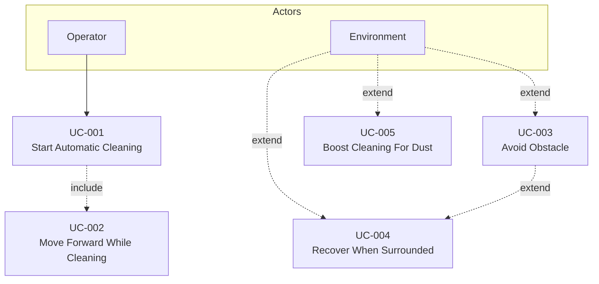

# Use Case Diagram (OOA 0)

## 1. 입력

| 문서 | 경로 |
|------|------|
| System Requirements | `docs/OOA/01-System-Requirements.md` |

## 2. Actor

| Actor | 역할 | SSD 이벤트 |
|-------|------|------------|
| **Operator** | RVC에 청소 **시작**을 요청 (power on·시작 경로는 black-box — 물리 버튼·앱 등 명시 없음) | `startAutomaticCleaning()` |
| **Environment** | 장애물·먼지 등 청소 환경 자극 | `obstacleDetected()`, `surroundedObstacleDetected()`, `dustDetected()` |

> `:System` = RVC SW Controller (SuD). 직진·회피·출력 강화는 **Operator 명령이 아닌** System 자율 동작 또는 Environment extend.

## 3. Use Case 목록

| UC | 이름 | FR | Primary Actor | 관계 |
|----|------|-----|---------------|------|
| UC-001 | Start Automatic Cleaning | FR-001 | Operator | base |
| UC-002 | Move Forward While Cleaning | FR-002 | — | UC-001 `<<include>>` |
| UC-003 | Avoid Obstacle | FR-003 | Environment | UC-001 `<<extend>>` |
| UC-004 | Recover When Surrounded | FR-004 | Environment | UC-003 `<<extend>>` |
| UC-005 | Boost Cleaning For Dust | FR-005 | Environment | UC-001 `<<extend>>` |

## 4. Use Case Diagram

## 5. FR 추적

| FR | Use Case |
|----|----------|
| FR-001 | UC-001 |
| FR-002 | UC-002 (include) |
| FR-003 | UC-003 |
| FR-004 | UC-004 |
| FR-005 | UC-005 |

## 6. UC 문서 매핑

| UC | 파일 |
|----|------|
| UC-001 | `docs/OOA/UseCases/UC-001.md` |
| UC-002 | `docs/OOA/UseCases/UC-002.md` |
| UC-003 | `docs/OOA/UseCases/UC-003.md` |
| UC-004 | `docs/OOA/UseCases/UC-004.md` |
| UC-005 | `docs/OOA/UseCases/UC-005.md` |
