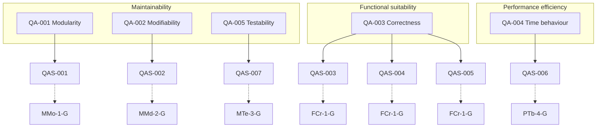
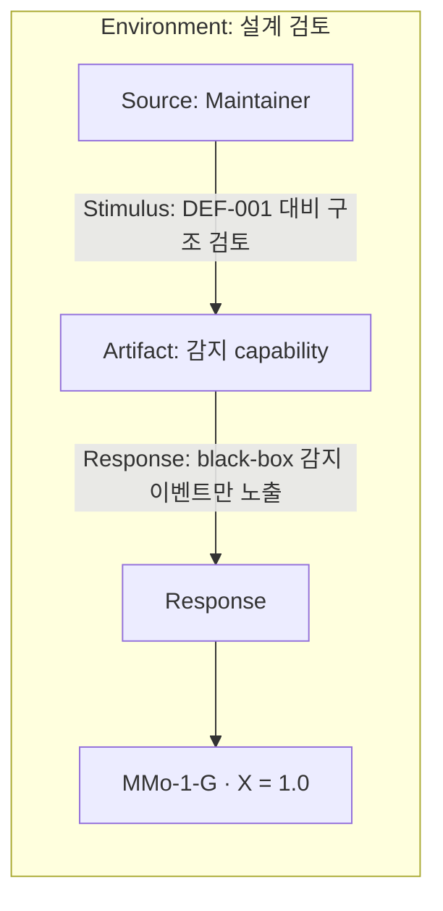
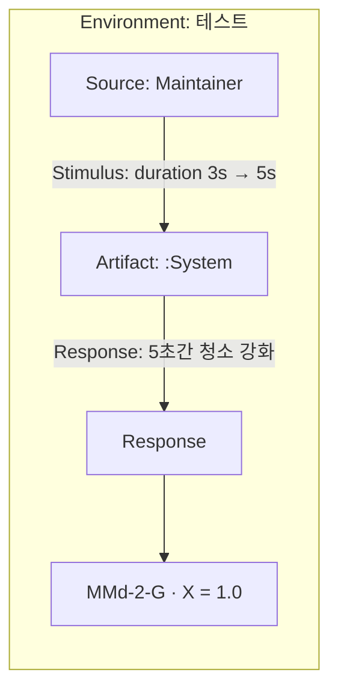
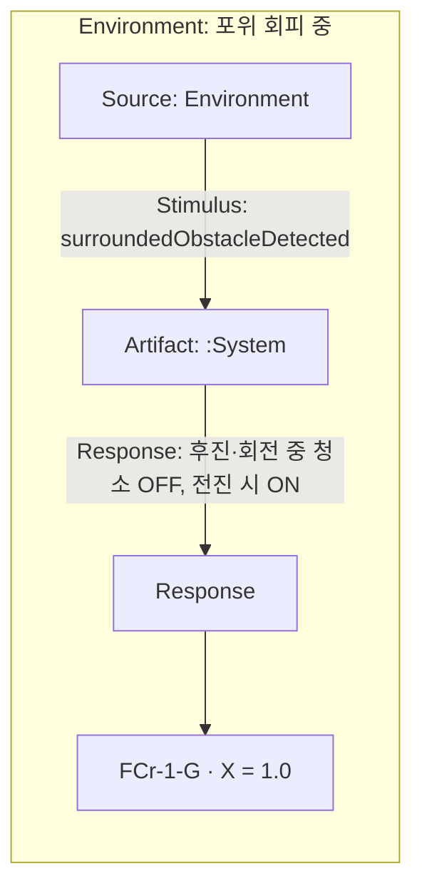
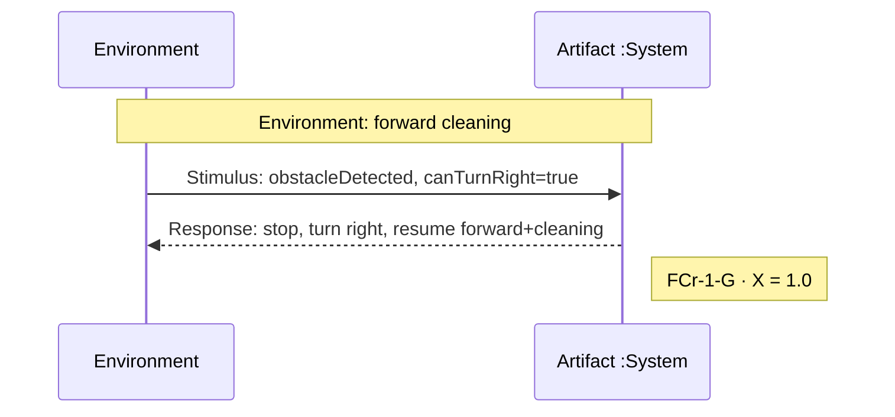
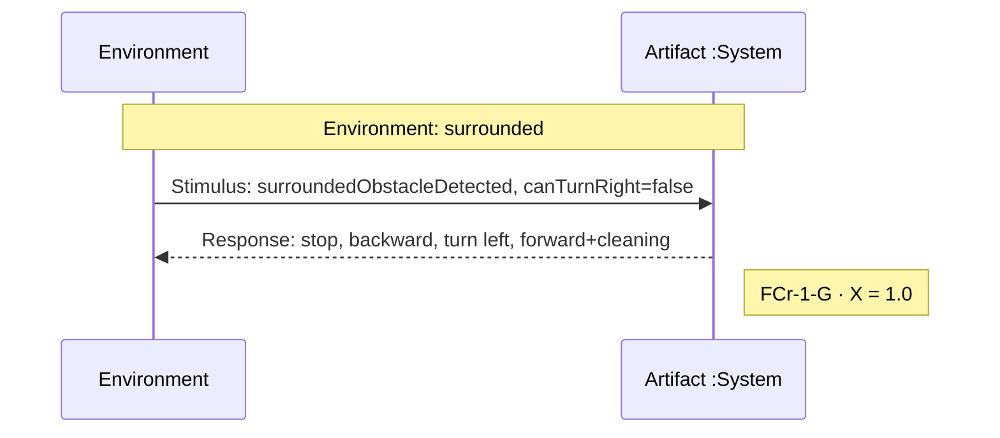
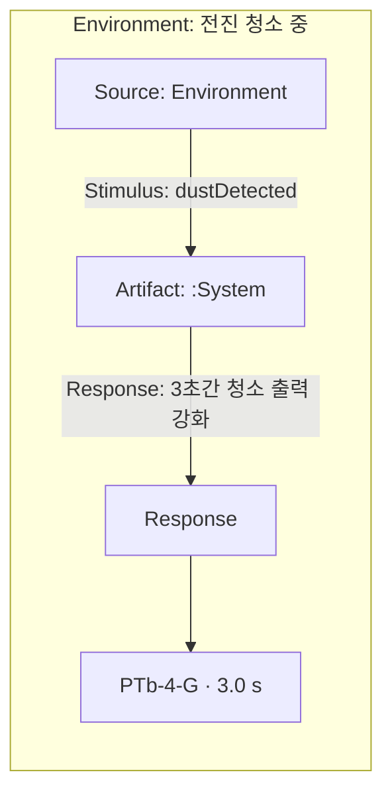
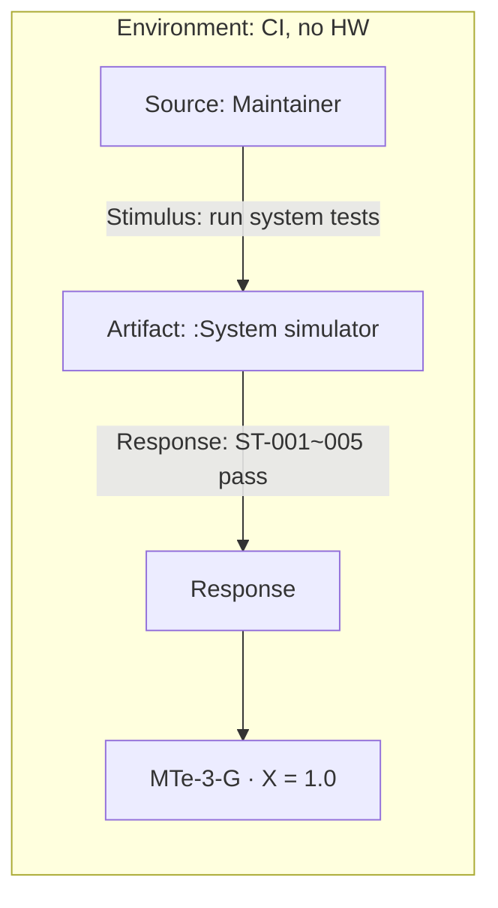

# System Requirements (01)

## §0. 문서 개요

### 0.1 입력 (@)

| ID | 문서 | 경로 |
|----|------|------|
| IN-001 | Preliminary Requirements for RVC SW Controller | `docs/Preliminary-Requirements.md` |

### 0.2 시스템 정의 및 범위

| 항목 | 내용 |
|------|------|
| **시스템명** | RVC SW Controller (로봇 청소기 소프트웨어 제어) |
| **시스템 목적** | 가정용 표면의 **자동 청소·물걸레** 기능을 소프트웨어로 제어한다. |
| **포함(In Scope)** | 직진 청소 이동, 장애물 감지·회피(전진/후진·좌우 전환), 먼지 감지 시 청소 출력 강화 |
| **제외(Out of Scope)** | HW 제어의 상세 설계·구현; 자동 청소 기능 이외(모바일 앱, ML, 한 지점 순환 청소, 센서 추가·변경 자체) |

### 0.3 ID · 추적 규칙

- 모든 FR·NFR·QA·QAS·보류·미해결 항목은 **IN-001** 출처 또는 하위 파생 근거를 갖는다.
- 출처 없는 요구 항목을 추가하지 않는다.
- **보류(Deferred)** 항목은 현재 FR로 승격하지 않는다.
- 수용기준은 원문에 명시된 내용과 **§4 해결 결정**을 포함한다.
- **§0~§6:** Plan-01 · **§7~§8:** OOA-01 (QA·QAS).

### 0.4 청소 동작 invariant

- **청소·물걸레는 전진(forward) 이동 중에만** 수행한다 (FR-002).
- 후진·방향 전환(제자리 회전) 중에는 청소를 **중지**한다.
- 회피 maneuver 완료 후 **전진을 재개할 때** 청소를 **재개**한다 (FR-003, FR-004).

---

## §1. Functional Requirements (FR)

### FR-001 — 자동 청소 및 물걸레

| 필드 | 내용 |
|------|------|
| **명세** | 시스템은 가정용 표면(household surface)을 **자동으로** 청소하고 물걸레질(mop)한다. |
| **우선순위** | Must |
| **리스크** | — |
| **수용기준(원문)** | "An RVC automatically cleans and mops household surface." |
| **관련 NFR** | NFR-002 |
| **출처** | IN-001 · L2 |
| **확장성** | 한 지점 순환 청소(보류 DEF-002) 추가 시 본 FR 하위 시나리오 확장 가능 |

---

### FR-002 — 청소 중 직진 전진

| 필드 | 내용 |
|------|------|
| **명세** | 청소하는 동안 시스템은 **직진(forward)** 으로 이동한다. **전진 중에만** 청소·물걸레를 수행한다. |
| **우선순위** | Must |
| **리스크** | — |
| **수용기준(원문)** | "It goes straight forward while cleaning." |
| **수용기준(결정)** | 후진·회전 중 청소 중지; 전진 재개 시 청소 재개 (§0.4, UR-002) |
| **관련 NFR** | NFR-005 |
| **출처** | IN-001 · L3 |
| **확장성** | — |

---

### FR-003 — 장애물 감지 시 회피 후 청소 재개

| 필드 | 내용 |
|------|------|
| **명세** | 센서가 장애물을 감지하면, 시스템은 청소를 **중지**하고, **우측 전환 가능 여부를 판단**한다. 가능하면 **우측**으로 전환하고, **불가하면 좌측**으로 전환한 뒤, **청소를 재개하며 전진**한다. |
| **우선순위** | Must |
| **리스크** | — |
| **수용기준(원문)** | "If its sensors found an obstacle, it stops cleaning, turns aside left or right, and goes forward with cleaning." |
| **수용기준(결정)** | `canTurnRight` 판단 → 가능: 우측, 불가: 좌측 (UR-001); 전진 시 청소 재개 (§0.4) |
| **관련 NFR** | NFR-001, NFR-003, NFR-006 |
| **출처** | IN-001 · L4 |
| **확장성** | 센서 추가·변경(보류 DEF-001) 시 감지 소스만 교체 가능하도록 분리 |

---

### FR-004 — 전·좌·우 장애물 시 후진·회피

| 필드 | 내용 |
|------|------|
| **명세** | **전방·좌측·우측** 모두 장애물이 있으면, 시스템은 **청소를 중지**하고 **후진**한다. 이후 **우측 전환 가능 여부를 판단**하고, 가능하면 **우측**, **불가하면 좌측**으로 전환한 뒤 **청소를 재개하며 전진**한다. |
| **우선순위** | Must |
| **리스크** | — |
| **수용기준(원문)** | "If there are obstacles in both front, left and right, it move backward and turn aside left or right, and goes forward." |
| **수용기준(결정)** | 후진·회전 중 청소 중지; `canTurnRight` 판단 → 가능: 우측, 불가: 좌측 (UR-001); 전진 재개 시 청소 재개 (UR-002, §0.4) |
| **관련 NFR** | NFR-001, NFR-003, NFR-006 |
| **출처** | IN-001 · L5 |
| **확장성** | 센서 추가·변경(보류 DEF-001) 시 방향별 감지 소스 확장 가능 |

---

### FR-005 — 먼지 감지 시 청소 출력 강화

| 필드 | 내용 |
|------|------|
| **명세** | 먼지를 감지하면, 시스템은 **3초 동안** 청소 출력을 **높인다(power up)**. |
| **우선순위** | Must |
| **리스크** | — |
| **수용기준(원문)** | "If it detects dust, power up the cleaning for a while." |
| **수용기준(결정)** | 강화 지속 시간 **3초** (UR-003); 추후 튜닝 가능 |
| **관련 NFR** | NFR-003, NFR-004, NFR-007 |
| **출처** | IN-001 · L6 |
| **확장성** | 센서 추가·변경(보류 DEF-001) 시 먼지 감지 소스 교체 가능; **강화 시간(3초)은 설정·튜닝 대상** |

---

## §2. Non-Functional Requirements (NFR)

### NFR-001 — HW 제어 상세 범위 제외

| 필드 | 내용 |
|------|------|
| **범주** | Scope / Architecture |
| **ISO 25010 characteristic** | — |
| **ISO 25010 subcharacteristic** | — |
| **요구** | HW 제어에 대한 **상세 설계·구현**은 본 시스템 범위에 **포함하지 않는다**. |
| **근거** | SW Controller 관점; HW는 추상화 대상 |
| **검증 방법** | 설계·구현 산출물에 HW 레지스터·드라이버 상세 명세 부재 확인 |
| **관련 FR** | FR-003, FR-004, FR-005 |
| **관련 QA** | — |
| **관련 QAS** | — |
| **출처** | IN-001 · L7 |

---

### NFR-002 — 자동 청소 기능 집중

| 필드 | 내용 |
|------|------|
| **범주** | Scope |
| **ISO 25010 characteristic** | — |
| **ISO 25010 subcharacteristic** | — |
| **요구** | 본 시스템은 **자동 청소 기능(automatic cleaning function)** 에만 초점을 둔다. |
| **근거** | 명시적 범위 한정 |
| **검증 방법** | 요구·설계·구현이 FR-001–005 및 관련 NFR 외 기능을 포함하지 않음 |
| **관련 FR** | FR-001 |
| **관련 QA** | — |
| **관련 QAS** | — |
| **출처** | IN-001 · L8 |

---

### NFR-003 — 센서 추상화 (확장 대비)

| 필드 | 내용 |
|------|------|
| **범주** | Quality |
| **ISO 25010 characteristic** | Maintainability |
| **ISO 25010 subcharacteristic** | Modularity |
| **요구** | 장애물·먼지 **감지**는 구체 센서 HW가 아닌 **추상화된 감지 capability** 로 표현 가능해야 한다. (향후 DEF-001 대비) |
| **근거** | "Future: The RVC will add or change sensors." — 현재 FR은 감지 **행위**만 요구 |
| **검증 방법** | OOA/OOD에서 센서 타입명·HW API 직접 노출 없이 black-box 감지 이벤트로 기술 |
| **관련 FR** | FR-003, FR-004, FR-005 |
| **관련 QA** | QA-001 |
| **관련 QAS** | QAS-001 |
| **출처** | IN-001 · L4–L6, L11 (보류 DEF-001 연계) |

---

### NFR-004 — 먼지 강화 시간 튜닝 가능

| 필드 | 내용 |
|------|------|
| **범주** | Quality |
| **ISO 25010 characteristic** | Maintainability |
| **ISO 25010 subcharacteristic** | Modifiability |
| **요구** | 먼지 감지 시 청소 출력 강화 **지속 시간(기본 3초)** 은 구현에서 **설정·튜닝** 가능해야 한다. |
| **근거** | UR-003 결정 — 초기값 3초, 추후 환경·성능에 따라 조정 필요 |
| **검증 방법** | 설정값 변경 시 FR-005 강화 지속 시간이 그에 따라 변경됨을 테스트로 확인 |
| **관련 FR** | FR-005 |
| **관련 QA** | QA-002 |
| **관련 QAS** | QAS-002 |
| **출처** | UR-003 (stakeholder 결정) |

---

### NFR-005 — 청소 상태 불변 (전진 시에만 청소)

| 필드 | 내용 |
|------|------|
| **범주** | Quality |
| **ISO 25010 characteristic** | Functional suitability |
| **ISO 25010 subcharacteristic** | Functional correctness |
| **요구** | 청소·물걸레 출력은 **전진 이동 중에만** 활성화되어야 하며, 후진·회전 중에는 **비활성**이어야 한다. 전진 재개 시 청소는 **재개**되어야 한다. |
| **근거** | FR-002 수용기준(결정); §0.4 invariant; UR-002 |
| **검증 방법** | 시뮬레이터·System test에서 이동 상태별 청소 출력 상태 검증 |
| **관련 FR** | FR-002, FR-004 |
| **관련 QA** | QA-003 |
| **관련 QAS** | QAS-003 |
| **출처** | IN-001 · L3; UR-002 |

---

### NFR-006 — 장애물 회피 동작 정확성

| 필드 | 내용 |
|------|------|
| **범주** | Quality |
| **ISO 25010 characteristic** | Functional suitability |
| **ISO 25010 subcharacteristic** | Functional correctness |
| **요구** | 장애물 감지 시 시스템은 명세된 회피 시퀀스(청소 중지 → 전환/후진 → 전진·청소 재개)를 수행해야 하며, `canTurnRight` 판단에 따라 **우측 우선·불가 시 좌측** 전환을 준수해야 한다. |
| **근거** | FR-003, FR-004; UR-001, UR-002; §0.4 |
| **검증 방법** | System test(ST-003, ST-004 등) 및 gtest로 회피 시퀀스·전환 방향 검증 |
| **관련 FR** | FR-003, FR-004 |
| **관련 QA** | QA-003 |
| **관련 QAS** | QAS-004, QAS-005 |
| **출처** | IN-001 · L4–L5; UR-001, UR-002 |

---

### NFR-007 — 먼지 강화 지속 시간

| 필드 | 내용 |
|------|------|
| **범주** | Quality |
| **ISO 25010 characteristic** | Performance efficiency |
| **ISO 25010 subcharacteristic** | Time behaviour |
| **요구** | 먼지 감지 후 청소 출력 강화는 **기본 3초** 동안 유지되어야 한다. |
| **근거** | FR-005; UR-003 |
| **검증 방법** | 시뮬레이터 tick·System test로 강화 시작~종료 시간 측정 |
| **관련 FR** | FR-005 |
| **관련 QA** | QA-004 |
| **관련 QAS** | QAS-006 |
| **출처** | IN-001 · L6; UR-003 |

---

## §3. 보류 (Deferred)

원문 *Future or Extended Requirements* — **현재 FR 승격 금지**.

| ID | 내용 (원문) | 출처 | 연관 FR/NFR |
|----|-------------|------|-------------|
| DEF-001 | The RVC will add or change sensors. | IN-001 · L11 | NFR-003, FR-003–005 확장성 |
| DEF-002 | It will be able to circulate one spot for a while. | IN-001 · L12 | FR-001 확장성 |
| DEF-003 | It will have to communicate with a mobile app. | IN-001 · L13 | NFR-002 (범위 외) |
| DEF-004 | It can do machine learning and inferring for more efficient cleaning. | IN-001 · L14 | NFR-002 (범위 외) |

---

## §4. 해결 결정 (Resolved)

| ID | 항목 | 결정 | 관련 FR | 근거 |
|----|------|------|---------|------|
| UR-001 | 좌/우 전환 선택 | **`canTurnRight` 판단** — 가능하면 **우측**, 불가하면 **좌측** 전환 | FR-003, FR-004 | stakeholder 결정 |
| UR-002 | FR-004 후 청소 상태 | 후진·회전 중 청소 **중지**; **전진 재개 시 청소 재개** (FR-002·§0.4와 동일 원칙) | FR-002, FR-004 | stakeholder 결정; "전진할 때만 청소" |
| UR-003 | 먼지 강화 지속 시간 | **3초**; 추후 상황에 따라 **튜닝** (NFR-004) | FR-005 | stakeholder 결정 |

**미해결 항목:** 없음

---

## §5. 추적성 매트릭스 (원문 → ID)

| 출처 (IN-001) | ID | QA | QAS | ISO 25023 | 비고 |
|---------------|-----|-----|------|-----------|------|
| L2 — automatically cleans and mops household surface | FR-001 | — | — | — | |
| L3 — goes straight forward while cleaning | FR-002 | QA-003 | QAS-003 | FCr-1-G | → NFR-005 |
| L4 — obstacle: stop, turn left/right, forward with cleaning | FR-003 | QA-003 | QAS-004 | FCr-1-G | UR-001; → NFR-006 |
| L5 — front+left+right obstacles: backward, turn, forward | FR-004 | QA-003 | QAS-005 | FCr-1-G | UR-001, UR-002 |
| L6 — detects dust, power up cleaning for a while | FR-005 | QA-004 | QAS-006 | PTb-4-G | UR-003 → 3초; → NFR-007 |
| L7 — do not consider HW controls detail design/implementation | NFR-001 | — | — | — | |
| L8 — only focus on automatic cleaning function | NFR-002 | — | — | — | |
| L11 — add or change sensors | DEF-001 | QA-001 | — | — | → NFR-003 |
| L12 — circulate one spot | DEF-002 | — | — | — | |
| L13 — communicate with mobile app | DEF-003 | — | — | — | |
| L14 — machine learning for efficient cleaning | DEF-004 | — | — | — | |
| UR-002 | NFR-005 | QA-003 | QAS-003 | FCr-1-G | FR 품질 승격 |
| UR-001, UR-002 | NFR-006 | QA-003 | QAS-004, QAS-005 | FCr-1-G | FR 품질 승격 |
| UR-003 | NFR-004 | QA-002 | QAS-002 | MMd-2-G | |
| UR-003 | NFR-007 | QA-004 | QAS-006 | PTb-4-G | FR 품질 승격 |
| L4–L6, L11 | NFR-003 | QA-001 | QAS-001 | MMo-1-G | |
| — (검증 방법 집약) | — | QA-005 | QAS-007 | MTe-3-G | NFR 검증 방법에서 파생 |

**커버리지:** IN-001 현재 범위(L2–L8) 전 항목 매핑 완료. Future(L11–L14) → 보류 4건.

---

## §6. 요약

| 구분 | 건수 |
|------|------|
| FR | 5 |
| NFR | 7 |
| QA | 5 |
| QAS | 7 |
| QAS 다이어그램 | 8 (개요 1 + QAS 7) |
| 보류 (Deferred) | 4 |
| 해결 결정 (Resolved) | 3 |
| 미해결 (Unresolved) | 0 |
| ISO 25010 매핑 NFR | 5 (NFR-003~007) |

---

## §7. Quality Attribute 카탈로그

### QA-001 — 감지 추상화 (Modularity)

| 필드 | 내용 |
|------|------|
| **ISO 25010 characteristic** | Maintainability |
| **ISO 25010 subcharacteristic** | Modularity |
| **설명** | 장애물·먼지 감지를 HW 독립 capability·이벤트로 분리하여 향후 센서 변경(DEF-001)에 대비한다. |
| **관련 NFR** | NFR-003 |
| **관련 FR/UR** | FR-003, FR-004, FR-005; DEF-001 연계 |
| **관련 QAS** | QAS-001 |
| **출처** | IN-001 · L4–L6, L11 |

---

### QA-002 — 런타임 설정 변경 (Modifiability)

| 필드 | 내용 |
|------|------|
| **ISO 25010 characteristic** | Maintainability |
| **ISO 25010 subcharacteristic** | Modifiability |
| **설명** | 먼지 강화 지속 시간 등 운영 파라미터를 코드 재배포 없이 설정·튜닝 가능하게 한다. |
| **관련 NFR** | NFR-004 |
| **관련 FR/UR** | FR-005; UR-003 |
| **관련 QAS** | QAS-002 |
| **출처** | UR-003 |

---

### QA-003 — 자율 청소 동작 정확성 (Functional correctness)

| 필드 | 내용 |
|------|------|
| **ISO 25010 characteristic** | Functional suitability |
| **ISO 25010 subcharacteristic** | Functional correctness |
| **설명** | 전진 시에만 청소, 장애물 회피 시퀀스·`canTurnRight` 우선 규칙을 정확히 준수한다. |
| **관련 NFR** | NFR-005, NFR-006 |
| **관련 FR/UR** | FR-002~004; UR-001, UR-002; §0.4 |
| **관련 QAS** | QAS-003, QAS-004, QAS-005 |
| **출처** | IN-001 · L3–L5; UR-001, UR-002 |

---

### QA-004 — 시간적 청소 행위 (Time behaviour)

| 필드 | 내용 |
|------|------|
| **ISO 25010 characteristic** | Performance efficiency |
| **ISO 25010 subcharacteristic** | Time behaviour |
| **설명** | 먼지 강화 지속 시간 등 시간 제약이 명세·UR과 일치해야 한다. |
| **관련 NFR** | NFR-007 |
| **관련 FR/UR** | FR-005; UR-003 |
| **관련 QAS** | QAS-006 |
| **출처** | IN-001 · L6; UR-003 |

---

### QA-005 — 자율 검증 가능성 (Testability)

| 필드 | 내용 |
|------|------|
| **ISO 25010 characteristic** | Maintainability |
| **ISO 25010 subcharacteristic** | Testability |
| **설명** | gtest·GUI 시뮬레이터·System test로 FR·NFR 품질 요구를 HW 없이 검증 가능해야 한다. |
| **관련 NFR** | NFR-003, NFR-004, NFR-005, NFR-006, NFR-007 (검증 방법) |
| **관련 FR/UR** | FR-001~005 |
| **관련 QAS** | QAS-007 |
| **출처** | NFR-003~007 검증 방법; OOI-01 테스트 전략 |

---

### 7.1 QA · QAS 개요 다이어그램

### 미채택 ISO 25010 특성

| Characteristic | 미채택 사유 |
|----------------|-------------|
| Usability | Operator는 청소 시작만; UI·학습성 요구 없음 (IN-001) |
| Security | 보안·인증 요구 없음 |
| Compatibility (Co-existence) | 다중 SW 공존 요구 없음; 센서 추상화는 Maintainability·Modularity로 처리 |
| Reliability (Availability, Recoverability) | 가용률·복구 SLA 미명시; 회피 정확성은 Functional correctness로 처리 |
| Portability | 플랫폼 이식 요구 없음; 범위 외 |
| Performance (Resource utilization, Capacity) | 자원·처리량 요구 미명시 |

---

## §8. Quality Attribute Scenarios (QAS)

### QAS-001 — 감지 capability 추상화

| 필드 | 내용 |
|------|------|
| **관련 QA** | QA-001 |
| **관련 NFR** | NFR-003 |
| **Source** | Maintainer |
| **Stimulus** | OOA/OOD 산출물 검토 요청 — 센서 HW 교체(DEF-001) 대비 구조 점검 |
| **Artifact** | :System · 감지 capability (장애물·먼지) |
| **Environment** | 설계 단계; 요구·도메인 모델 검토 |
| **Response** | 장애물·먼지 감지가 **구체 센서 타입·HW API 없이** black-box 이벤트(`obstacleDetected`, `dustDetected` 등)로만 기술됨 |
| **Response Measure** | 아래 표 참조 |
| **관련 FR** | FR-003, FR-004, FR-005 |
| **출처** | NFR-003; IN-001 · L11 (DEF-001 연계) |

**Response Measure**

| 필드 | 내용 |
|------|------|
| **Measure ID** | MMo-1-G |
| **Name** | Coupling of components |
| **ISO 25010** | Maintainability · Modularity |
| **Function** | X = A/B (A=타 변경 무영향 컴포넌트 수, B=독립 요구 컴포넌트 수) |
| **Target** | X = 1.0 — 감지 capability가 이동·청소 제어와 **결합 없이** 교체 가능한 단위로 기술 |
| **Acceptable range** | X ≥ 1.0 |
| **Verification** | **internal** — OOA Domain Model·OOD DCD 리뷰; HW/센서 타입명 부재 확인 |

#### QAS-001 Diagram

---

### QAS-002 — 먼지 강화 시간 설정 변경

| 필드 | 내용 |
|------|------|
| **관련 QA** | QA-002 |
| **관련 NFR** | NFR-004 |
| **Source** | Maintainer |
| **Stimulus** | 먼지 강화 지속 시간 설정값을 기본 3초에서 **5초**로 변경 |
| **Artifact** | :System · 설정(configuration) |
| **Environment** | 유지보수·테스트; 시뮬레이터 또는 단위 테스트 |
| **Response** | `dustDetected` 후 청소 출력 강화가 **변경된 설정값(5초)** 동안 유지됨 |
| **Response Measure** | 아래 표 참조 |
| **관련 FR** | FR-005 |
| **출처** | NFR-004; UR-003 |

**Response Measure**

| 필드 | 내용 |
|------|------|
| **Measure ID** | MMd-2-G |
| **Name** | Modification capability |
| **ISO 25010** | Maintainability · Modifiability |
| **Function** | X = A/B (A=기한 내 완료 수정, B=요구 수정) |
| **Target** | X = 1.0 — 설정 변경 후 **1회 테스트 실행** 내 FR-005 동작 반영 확인 |
| **Acceptable range** | X = 1.0 |
| **Verification** | **external** — gtest 또는 System test; 설정 변경 전후 강화 시간 비교 |

#### QAS-002 Diagram

---

### QAS-003 — 전진 외 청소 중지

| 필드 | 내용 |
|------|------|
| **관련 QA** | QA-003 |
| **관련 NFR** | NFR-005 |
| **Source** | Environment |
| **Stimulus** | `surroundedObstacleDetected` → 후진·회전 maneuver |
| **Artifact** | :System |
| **Environment** | 자동 청소 세션 중; 전진 청소 후 포위 상황 (FR-004) |
| **Response** | 후진·회전 동안 청소 출력 **OFF**; 전진 재개 시 청소 **ON** |
| **Response Measure** | 아래 표 참조 |
| **관련 FR** | FR-002, FR-004 |
| **출처** | §0.4; UR-002; NFR-005 |

**Response Measure**

| 필드 | 내용 |
|------|------|
| **Measure ID** | FCr-1-G |
| **Name** | Functional correctness |
| **ISO 25010** | Functional suitability · Functional correctness |
| **Function** | X = 1 − A/B (A=오류 기능, B=평가 기능) |
| **Target** | X = 1.0 — 후진·회전 구간 **100%** 청소 중지; 전진 재개 구간 **100%** 청소 재개 |
| **Acceptable range** | X = 1.0 |
| **Verification** | **external** — System test ST-004; tick별 청소 상태 로그 |

#### QAS-003 Diagram

---

### QAS-004 — 단일 장애물 회피 및 전환

| 필드 | 내용 |
|------|------|
| **관련 QA** | QA-003 |
| **관련 NFR** | NFR-006 |
| **Source** | Environment |
| **Stimulus** | `obstacleDetected` (전방 장애물; `canTurnRight` = true) |
| **Artifact** | :System |
| **Environment** | 전진 청소 중 (FR-003) |
| **Response** | 청소 중지 → **우측** 전환 → 전진·청소 재개 |
| **Response Measure** | 아래 표 참조 |
| **관련 FR** | FR-003 |
| **출처** | UR-001; NFR-006 |

**Response Measure**

| 필드 | 내용 |
|------|------|
| **Measure ID** | FCr-1-G |
| **Name** | Functional correctness |
| **ISO 25010** | Functional suitability · Functional correctness |
| **Function** | X = 1 − A/B |
| **Target** | X = 1.0 — `canTurnRight`=true 시 **우측** 전환 시나리오 100% 준수 |
| **Acceptable range** | X = 1.0 |
| **Verification** | **external** — System test ST-003 |

#### QAS-004 Diagram

---

### QAS-005 — 포위 시 후진·회피

| 필드 | 내용 |
|------|------|
| **관련 QA** | QA-003 |
| **관련 NFR** | NFR-006 |
| **Source** | Environment |
| **Stimulus** | `surroundedObstacleDetected` (`canTurnRight` = false) |
| **Artifact** | :System |
| **Environment** | 전·좌·우 장애물 (FR-004) |
| **Response** | 청소 중지 → **후진** → **좌측** 전환 → 전진·청소 재개 |
| **Response Measure** | 아래 표 참조 |
| **관련 FR** | FR-004 |
| **출처** | UR-001, UR-002; NFR-006 |

**Response Measure**

| 필드 | 내용 |
|------|------|
| **Measure ID** | FCr-1-G |
| **Name** | Functional correctness |
| **ISO 25010** | Functional suitability · Functional correctness |
| **Function** | X = 1 − A/B |
| **Target** | X = 1.0 — 후진 후 `canTurnRight`=false 시 **좌측** 전환 100% 준수 |
| **Acceptable range** | X = 1.0 |
| **Verification** | **external** — System test ST-004 |

#### QAS-005 Diagram

---

### QAS-006 — 먼지 강화 3초 유지

| 필드 | 내용 |
|------|------|
| **관련 QA** | QA-004 |
| **관련 NFR** | NFR-007 |
| **Source** | Environment |
| **Stimulus** | `dustDetected` |
| **Artifact** | :System |
| **Environment** | 전진 청소 중 (FR-005) |
| **Response** | 청소 출력 **강화(power up)** 가 **3초** 후 기본 출력으로 복귀 |
| **Response Measure** | 아래 표 참조 |
| **관련 FR** | FR-005 |
| **출처** | UR-003; NFR-007 |

**Response Measure**

| 필드 | 내용 |
|------|------|
| **Measure ID** | PTb-4-G |
| **Name** | Mean turnaround time |
| **ISO 25010** | Performance efficiency · Time behaviour |
| **Function** | X = Σ(Bi−Ai)/n (작업 완료 시간) |
| **Target** | X = **3.0 s** (시뮬레이터 tick 환산; UR-003) |
| **Acceptable range** | 2.9 s ≤ X ≤ 3.1 s **(Assumption:** tick 해상도에 따른 ±0.1s — stakeholder 확인 권고) |
| **Verification** | **external** — System test ST-005; tick 로그 |

#### QAS-006 Diagram

---

### QAS-007 — 시뮬레이터 자율 System test

| 필드 | 내용 |
|------|------|
| **관련 QA** | QA-005 |
| **관련 NFR** | NFR-005, NFR-006, NFR-007 |
| **Source** | Maintainer (테스트 실행자) |
| **Stimulus** | `rvc_system_test` 로 ST-001~005 시나리오 일괄 실행 |
| **Artifact** | :System (시뮬레이터 블랙박스) |
| **Environment** | CI 또는 로컬; 실제 HW **미연결** |
| **Response** | FR·NFR 관련 System test가 **HW stub 없이** 통과 |
| **Response Measure** | 아래 표 참조 |
| **관련 FR** | FR-001~005 |
| **출처** | NFR-003~007 검증 방법; OOI-01 |

**Response Measure**

| 필드 | 내용 |
|------|------|
| **Measure ID** | MTe-3-G |
| **Name** | Autonomous testability |
| **ISO 25010** | Maintainability · Testability |
| **Function** | X = A/B (A=stub 없이 실행 가능 테스트, B=외부 의존 테스트) |
| **Target** | X = 1.0 — System test 시나리오 **100%** 시뮬레이터만으로 실행 |
| **Acceptable range** | X = 1.0 |
| **Verification** | **external** — `rvc_system_test.exe` 실행; HW 의존 0건 |

#### QAS-007 Diagram

