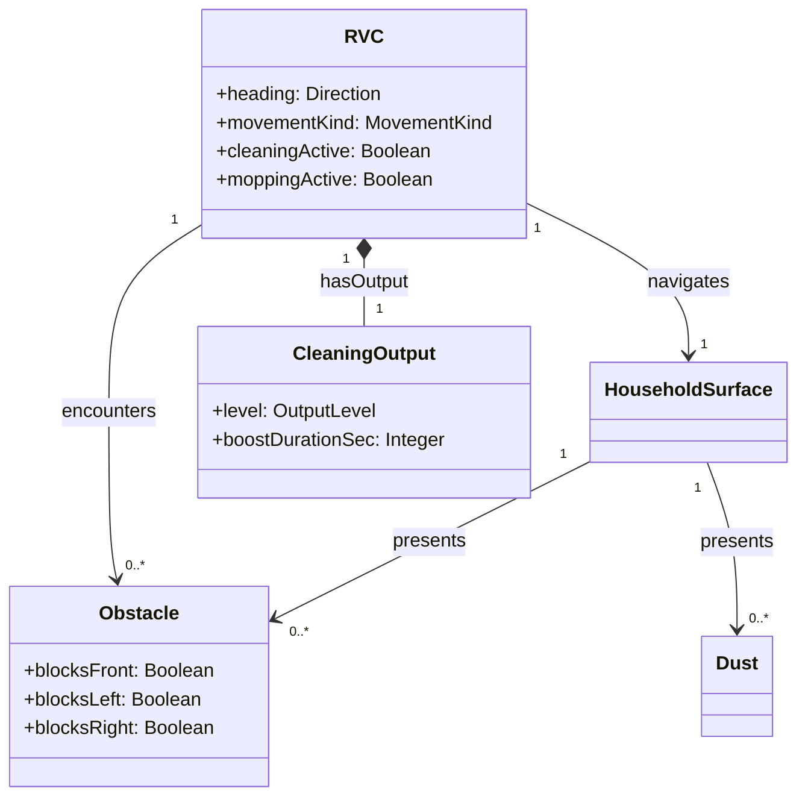

# Domain Model (OOA 2)

## 1. 입력

| 문서 | 경로 |
|------|------|
| System Requirements | `docs/OOA/01-System-Requirements.md` |
| UC-001 Automatic Forward Cleaning | `docs/OOA/UseCases/UC-001.md` |
| UC-002 Avoid Obstacle | `docs/OOA/UseCases/UC-002.md` |
| UC-003 Surrounded Obstacle Recovery | `docs/OOA/UseCases/UC-003.md` |
| UC-004 Dust Boost Cleaning | `docs/OOA/UseCases/UC-004.md` |

## 2. 요약

개념 클래스 **5** · 연관 **5**

| 개념 | 역할 |
|------|------|
| RVC | 청소·이동 주체 |
| HouseholdSurface | 청소 대상 표면 |
| Obstacle | 경로·회피를 유발하는 장애물 |
| Dust | 청소 출력 강화를 유발하는 먼지 |
| CleaningOutput | 청소·물걸레 출력 수준 |

> `:System`·Operator·Environment(Actor)·Sensor HW·Controller 등 SW/HW 구현 타입은 **도메인 클래스로 두지 않음** (NFR-001, NFR-003).

---

## 3. 명사구 분석

| 출처(UC/FR) | 명사구 | 후보 | 채택 | 비고 |
|-------------|--------|------|------|------|
| FR-001, UC-001 | RVC / robot vacuum | RVC | ✅ | 물리적 주체 |
| FR-001 | household surface | HouseholdSurface | ✅ | 청소 대상 |
| FR-001 | cleaning, mopping | CleaningOutput, RVC | ✅ | 출력→CleaningOutput; 활성→RVC |
| FR-002, §0.4 | forward, straight | RVC.movementKind | ✅ | RVC 속성 |
| FR-003–004, UC-002–003 | obstacle | Obstacle | ✅ | |
| FR-003–004 | turn right / left | RVC.heading | ✅ | 방향 속성; `canTurnRight`는 Obstacle.blocksRight에서 도출 |
| FR-004 | front, left, right (blocked) | Obstacle.blocks* | ✅ | |
| FR-004 | backward | RVC.movementKind | ✅ | |
| FR-005, UC-004 | dust | Dust | ✅ | |
| FR-005, UR-003 | cleaning power / output | CleaningOutput | ✅ | |
| FR-005, NFR-004 | 3 seconds, duration | CleaningOutput.boostDurationSec | ✅ | |
| UC-001–004 | Operator | — | ❌ | Actor |
| UC-002–004 | Environment | — | ❌ | Actor |
| UC·SSD | System, sensor | — | ❌ | SuD·HW 추상화 대상 |
| — | Grid | — | ❌ | 현재 FR·UC 출처 없음 |
| UC-001 | automatic cleaning session | RVC.cleaningActive | ✅ | 별도 Session 클래스 대신 RVC 상태 |

---

## 4. 개념 클래스 목록

| 클래스 | 설명 | 속성 | 관련 UC/FR |
|--------|------|------|------------|
| **RVC** | 가정용 로봇 청소기. 표면 위에서 이동하며 청소·물걸레를 수행한다. | `heading: Direction` · `movementKind: Forward \| Backward \| Turning \| Stopped` · `cleaningActive: Boolean` · `moppingActive: Boolean` | UC-001–004 · FR-001–004 · §0.4 |
| **HouseholdSurface** | RVC가 청소·물걸레하는 가정용 표면. | _(위치·크기는 현 FR 범위 밖 — 속성 없음)_ | UC-001 · FR-001 |
| **Obstacle** | RVC 진로 또는 회피 방향을 막는 장애물. | `blocksFront: Boolean` · `blocksLeft: Boolean` · `blocksRight: Boolean` | UC-002, UC-003 · FR-003, FR-004 · UR-001 |
| **Dust** | RVC가 감지하는 먼지. 청소 출력 강화를 유발한다. | _(농도 등은 현 FR 미명시 — 속성 없음)_ | UC-004 · FR-005 |
| **CleaningOutput** | 청소·물걸레 출력 수준. | `level: Normal \| Boosted` · `boostDurationSec: Integer` (기본 3, NFR-004) | UC-001, UC-004 · FR-001, FR-005 · UR-003, NFR-004 |

**Direction (값 개념, RVC.heading 타입):** RVC가 향하는 방향. 회피 시 좌·우 전환과 직진 전진에 사용된다.

---

## 5. 연관

| 연관 | 끝1 | 다중성1 | 끝2 | 다중성2 | 설명 |
|------|-----|---------|-----|---------|------|
| navigates | RVC | 1 | HouseholdSurface | 1 | RVC가 표면 위에서 청소·이동 (FR-001) |
| presents | HouseholdSurface | 1 | Obstacle | 0..* | 표면(환경)에 장애물 존재 (UC-002, UC-003) |
| presents | HouseholdSurface | 1 | Dust | 0..* | 표면에 먼지 존재 (UC-004) |
| encounters | RVC | 1 | Obstacle | 0..* | 이동 중 장애물 감지·회피 (FR-003, FR-004) |
| hasOutput | RVC | 1 | CleaningOutput | 1 | RVC의 청소·물걸레 출력 (FR-001, FR-005) |

---

## 6. Domain Model Diagram

---

## 7. Traceability Matrix

| UC / FR | 관련 개념 |
|---------|-----------|
| FR-001 | RVC, HouseholdSurface, CleaningOutput (cleaningActive, moppingActive) |
| FR-002, §0.4 | RVC (movementKind=Forward, cleaningActive), CleaningOutput |
| FR-003 | RVC, Obstacle, CleaningOutput |
| FR-004 | RVC, Obstacle (blocksFront/Left/Right), CleaningOutput |
| FR-005 | Dust, CleaningOutput (level=Boosted, boostDurationSec) |
| NFR-004 | CleaningOutput.boostDurationSec |
| UC-001 | RVC, HouseholdSurface, CleaningOutput |
| UC-002 | RVC, Obstacle, CleaningOutput |
| UC-003 | RVC, Obstacle, CleaningOutput |
| UC-004 | RVC, Dust, CleaningOutput |

---

## 8. OOD handoff 메모

- `canTurnRight()` (SSD)는 도메인에서 **Obstacle.blocksRight == false** (및 전방 회피 맥락)로 해석 가능.
- §0.4 invariant: `movementKind ∈ {Backward, Turning}` → `cleaningActive = false`; `Forward` → 청소 재개.
- Grid·좌표계는 현 FR 범위 밖; OOI 시뮬레이터 map은 **표현(representation gap)** 으로 OOD에서 도입.
