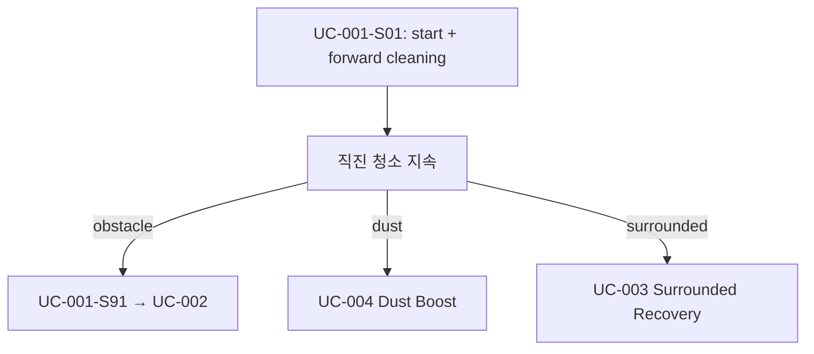
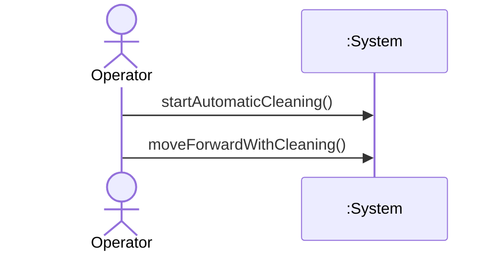
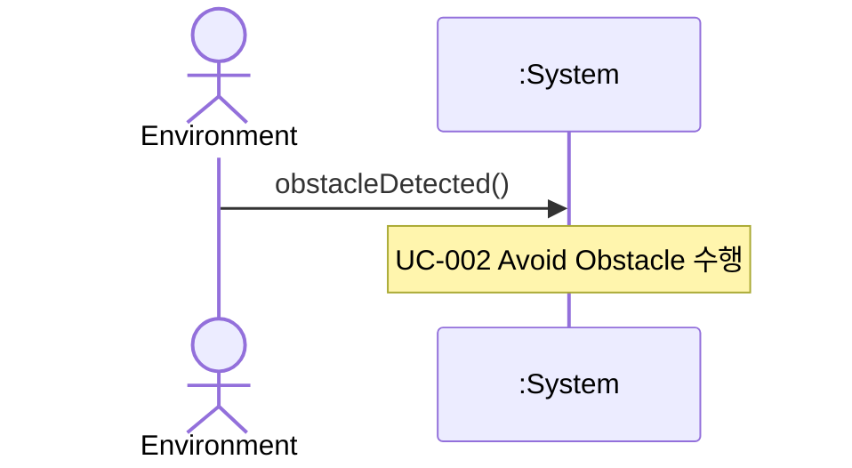

# UC-001 — Automatic Forward Cleaning

**목표:** 가정용 표면에서 자동 청소·물걸레를 수행하며 직진 전진한다.

## Actor

| 역할 | Actor | 설명 |
|------|-------|------|
| Primary | Operator | 자동 청소를 기대·시작하는 주체 (UI·디바이스명 없음, black-box) |

## Pre-Requisites

- RVC가 가동 가능 상태이다. (NFR-002)
- HW 제어 상세는 System 경계 밖이다. (NFR-001)
- 청소 대상 표면(household surface) 위에 있다. (FR-001)
- 자동 청소 기능 범위 내 동작만 수행한다. (NFR-002)

## Typical Courses of Events — UC-001-S01

| # | 행위 / 반응 | FR/NFR |
|---|-------------|--------|
| 1 | Operator가 자동 청소를 시작한다. | FR-001, NFR-002 |
| 2 | System이 자동으로 청소·물걸레를 시작한다. | FR-001 |
| 3 | System이 직진으로 전진하며 청소·물걸레를 계속한다. | FR-002, §0.4 |

## Alternative Courses of Events

_(해당 FR 범위 내 별도 분기 없음)_

## Exceptional Courses of Events

| 시나리오 | # | 행위 / 반응 | FR/NFR |
|----------|---|-------------|--------|
| UC-001-S91 | 1 | 전진 청소 중 Environment가 장애물을 제시한다. | — |
| UC-001-S91 | 2 | System은 **UC-002** Avoid Obstacle 흐름으로 전환한다. | FR-003 |

## 시나리오 ID 요약

| 시나리오 ID | 설명 | SSD |
|-------------|------|-----|
| UC-001-S01 | 자동 청소 시작 후 직진 전진 | SSD-UC-001-S01 |
| UC-001-S91 | 장애물로 인해 UC-002 위임 | SSD-UC-001-S91 |

## Postconditions (성공 — S01)

- System이 자동 청소·물걸레 모드이며 직진 전진 중이다.
- 청소·물걸레는 전진 중에만 활성이다. (§0.4)

## Mermaid — 분기 요약

---

# SSD-UC-001-S01

- **UC 시나리오:** UC-001-S01
- **Actor:** Operator
- **목적:** 자동 청소·물걸레 시작 및 직진 전진

| System Event | System Operation | Parameters | FR/NFR |
|--------------|------------------|------------|--------|
| startAutomaticCleaning | startAutomaticCleaning | — | FR-001, NFR-002 |
| moveForwardWithCleaning | moveForwardWithCleaning | — | FR-002, §0.4 |

---

# SSD-UC-001-S91

- **UC 시나리오:** UC-001-S91
- **Actor:** Operator, Environment
- **목적:** 전진 청소 중 장애물 이벤트 → UC-002 위임

| System Event | System Operation | Parameters | FR/NFR |
|--------------|------------------|------------|--------|
| obstacleDetected | handleObstacleDetected | — | FR-003, NFR-003 |
