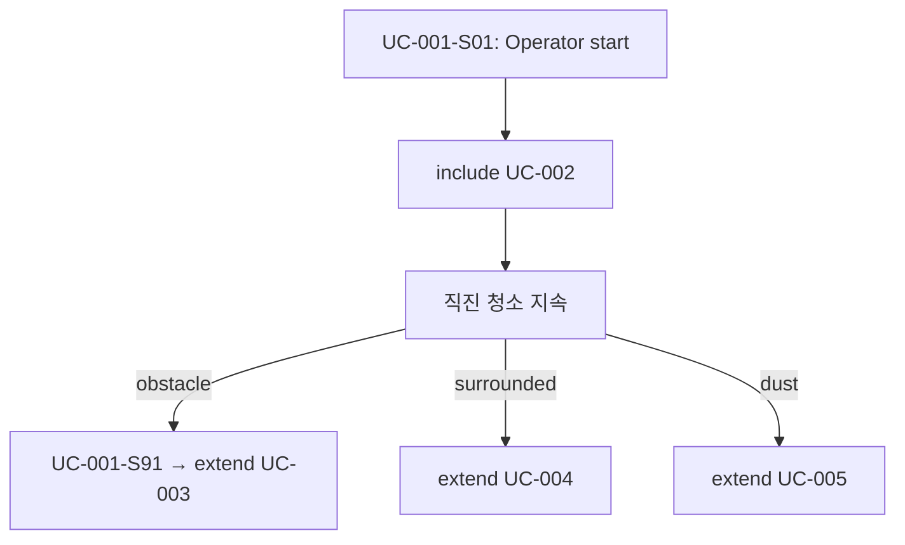
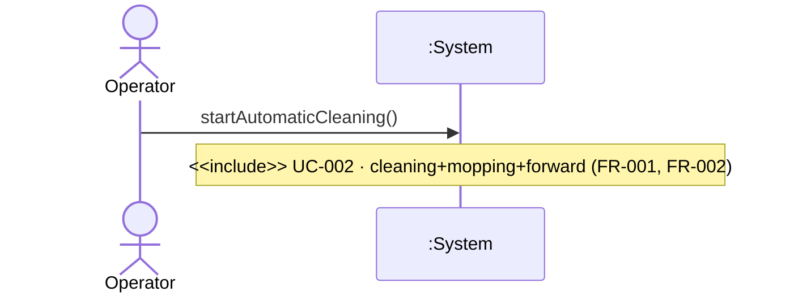
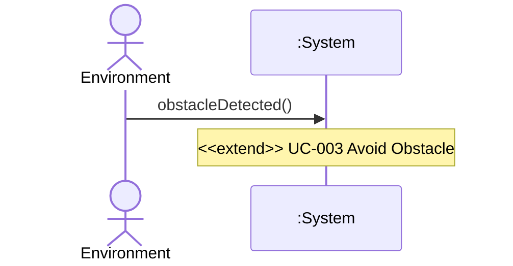

# UC-001 — Start Automatic Cleaning

**목표:** Operator가 자동 청소·물걸레 세션을 시작한다. (직진 전진은 UC-002 include)

## Actor

| 역할 | Actor | 설명 |
|------|-------|------|
| Primary | Operator | 청소 **시작**만 요청 (power on·시작 UI는 black-box) |

## Pre-Requisites

- RVC가 가동 가능 상태이다. (NFR-002)
- HW 제어 상세는 System 경계 밖이다. (NFR-001)
- 청소 대상 표면(household surface) 위에 있다. (FR-001)

## Typical Courses of Events — UC-001-S01

| # | 행위 / 반응 | FR/NFR |
|---|-------------|--------|
| 1 | Operator가 자동 청소를 **시작**한다. | FR-001, NFR-002 |
| 2 | System이 청소·물걸레를 활성화한다. | FR-001 |
| 3 | System이 **UC-002** Move Forward While Cleaning을 **include** 수행한다. | FR-002, NFR-005, §0.4 |

## Alternative Courses of Events

_(현재 FR 범위 내 별도 분기 없음)_

## Exceptional Courses of Events — UC-001-S91

| # | 행위 / 반응 | FR/NFR |
|---|-------------|--------|
| 1 | 청소 세션 중 Environment가 장애물을 제시한다. | — |
| 2 | System은 **UC-003** Avoid Obstacle `<<extend>>`를 수행한다. | FR-003, NFR-006 |

## 시나리오 ID 요약

| 시나리오 ID | 설명 | SSD |
|-------------|------|-----|
| UC-001-S01 | Operator 시작 → include UC-002 | SSD-UC-001-S01 |
| UC-001-S91 | 장애물 extend → UC-003 | SSD-UC-001-S91 |

## Postconditions (성공 — S01)

- 자동 청소·물걸레 세션이 활성이다.
- System이 UC-002에 따라 직진 전진 청소 중이다. (§0.4)

## Mermaid — 분기 요약

---

# SSD-UC-001-S01

- **UC 시나리오:** UC-001-S01
- **Actor:** Operator
- **목적:** 자동 청소 세션 시작 (Operator → System 이벤트 1건)

| System Event | System Operation | Parameters | FR/NFR |
|--------------|------------------|------------|--------|
| startAutomaticCleaning | startAutomaticCleaning | — | FR-001, NFR-002 |

---

# SSD-UC-001-S91

- **UC 시나리오:** UC-001-S91
- **Actor:** Environment
- **목적:** 청소 중 장애물 → UC-003 extend

| System Event | System Operation | Parameters | FR/NFR |
|--------------|------------------|------------|--------|
| obstacleDetected | handleObstacleDetected | — | FR-003, NFR-003 |
