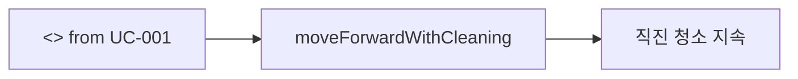
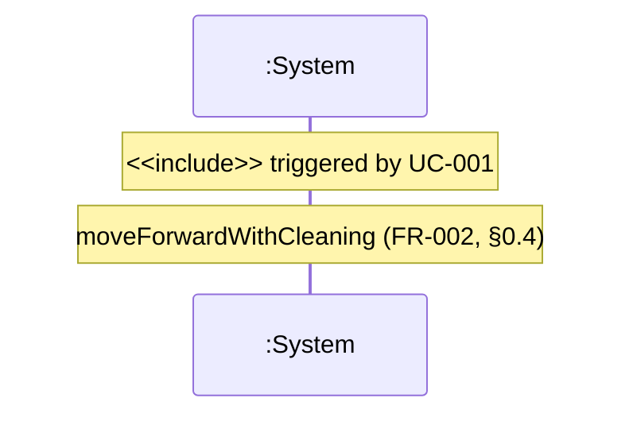

# UC-002 — Move Forward While Cleaning

**목표:** 청소·물걸레를 유지하며 **직진(forward)** 으로 이동한다. (Operator 이벤트 없음 — UC-001 include)

## Actor

| 역할 | Actor | 설명 |
|------|-------|------|
| _(없음)_ | — | System **자율 동작**; UC-001 `<<include>>` |

## Pre-Requisites

- UC-001에 의해 자동 청소·물걸레가 활성화되었다. (FR-001)
- 전진 중에만 청소·물걸레를 수행한다. (§0.4)

## Typical Courses of Events — UC-002-S01

| # | 행위 / 반응 | FR/NFR |
|---|-------------|--------|
| 1 | System이 직진으로 전진한다. | FR-002, NFR-005 |
| 2 | System이 전진 중 청소·물걸레를 수행한다. | FR-002, NFR-005, §0.4 |

## Alternative / Exceptional

_(현재 FR 범위 내 별도 시나리오 없음 — 회피·먼지는 UC-003–005 extend)_

## 시나리오 ID 요약

| 시나리오 ID | 설명 | SSD |
|-------------|------|-----|
| UC-002-S01 | 직진 전진 청소 (include) | SSD-UC-002-S01 |

## Postconditions

- System이 `movementKind=Forward`, 청소·물걸레 활성. (§0.4)

## Mermaid

---

# SSD-UC-002-S01

- **UC 시나리오:** UC-002-S01
- **Trigger:** `<<include>>` from UC-001 `startAutomaticCleaning`
- **Actor:** _(없음 — SSD Actor→System 이벤트 없음)_
- **목적:** FR-002 직진 전진 청소

| System Event | System Operation | Parameters | FR/NFR |
|--------------|------------------|------------|--------|
| moveForwardWithCleaning | moveForwardWithCleaning | — | FR-002, NFR-005, §0.4 |
