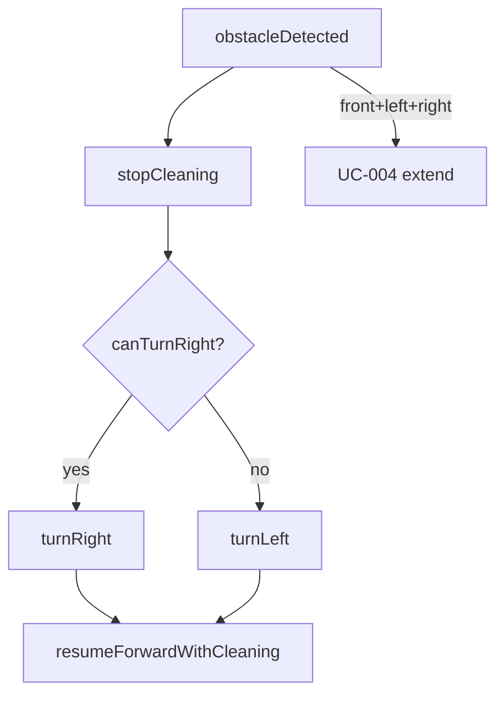
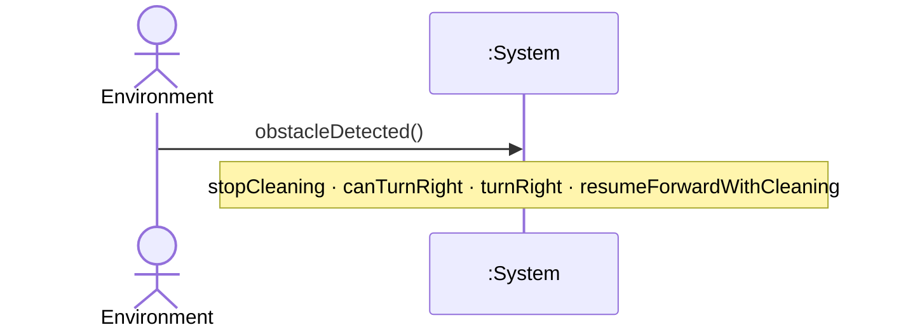
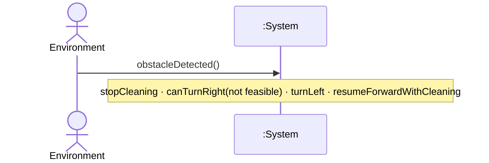
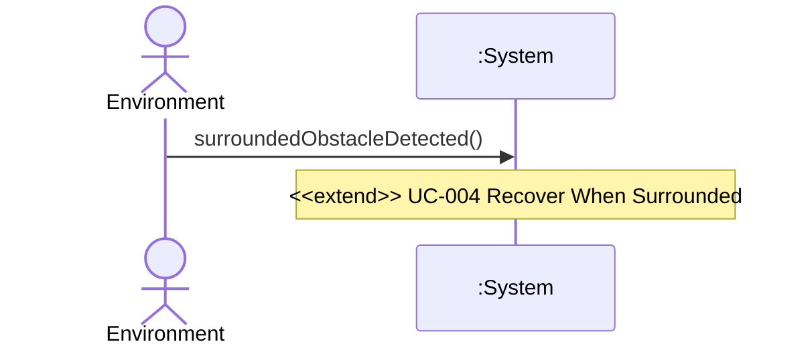

# UC-003 — Avoid Obstacle

**목표:** 장애물 감지 시 청소를 중지하고 우측(1차) 또는 좌측(2차)으로 회피한 뒤 전진·청소를 재개한다.

## Actor

| 역할 | Actor | 설명 |
|------|-------|------|
| Primary | Environment | 장애물 존재를 System에 알리는 자극 (black-box, NFR-003) |

## Pre-Requisites

- UC-001 청소 세션 중이다. (`<<extend>>`)
- System이 청소·전진 중이거나 이동 가능 상태이다. (FR-002, §0.4)
- 전방·좌·우 **동시** 막힘은 아니다 — 해당 경우 **UC-004**. (FR-004)

## Typical Courses of Events — UC-003-S01

**우측 회피 성공 (UR-001 1차)**

| # | 행위 / 반응 | FR/NFR |
|---|-------------|--------|
| 1 | Environment가 장애물을 감지·제시한다. | NFR-003 |
| 2 | System이 청소를 중지한다. | FR-003, §0.4 |
| 3 | System이 우측 전환 **가능** 여부를 판단한다. | FR-003, UR-001 |
| 4 | System이 우측으로 방향을 전환한다. | FR-003, UR-001 |
| 5 | System이 직진 전진하며 청소·물걸레를 재개한다. | FR-003, §0.4 |

## Alternative Courses of Events — UC-003-S02

**우측 불가 → 좌측 회피 (UR-001 2차)**

| # | 행위 / 반응 | FR/NFR |
|---|-------------|--------|
| 1 | Environment가 장애물을 감지·제시한다. | NFR-003 |
| 2 | System이 청소를 중지한다. | FR-003, §0.4 |
| 3 | System이 우측 전환 가능 여부를 판단한다 — **불가**. | FR-003, UR-001 |
| 4 | System이 좌측으로 방향을 전환한다. | FR-003, UR-001 |
| 5 | System이 직진 전진하며 청소·물걸레를 재개한다. | FR-003, §0.4 |

## Exceptional Courses of Events — UC-003-S91

| # | 행위 / 반응 | FR/NFR |
|---|-------------|--------|
| 1 | Environment가 전방·좌측·우측 모두 장애물을 제시한다. | NFR-003 |
| 2 | System은 **UC-004** Recover When Surrounded `<<extend>>`를 수행한다. | FR-004 |

## 시나리오 ID 요약

| 시나리오 ID | 설명 | SSD |
|-------------|------|-----|
| UC-003-S01 | 장애물 → 우측 회피 → 전진 청소 재개 | SSD-UC-003-S01 |
| UC-003-S02 | 장애물 → 우측 불가 → 좌측 → 전진 청소 재개 | SSD-UC-003-S02 |
| UC-003-S91 | 삼방향 막힘 → UC-004 extend | SSD-UC-003-S91 |

## Postconditions (성공 — S01, S02)

- System이 장애물을 회피한 방향으로 재정렬되었다.
- System이 직진 전진하며 청소·물걸레를 수행 중이다. (§0.4)

## Mermaid — 분기 요약

---

# SSD-UC-003-S01

- **UC 시나리오:** UC-003-S01
- **Actor:** Environment
- **목적:** 우측 회피 성공

| System Event | System Operation | Parameters | FR/NFR |
|--------------|------------------|------------|--------|
| obstacleDetected | handleObstacleDetected | — | FR-003, NFR-003 |
| stopCleaning | stopCleaning | — | FR-003, §0.4 |
| canTurnRight | canTurnRight | — | FR-003, UR-001 |
| turnRight | turnRight | — | FR-003, UR-001 |
| resumeForwardWithCleaning | resumeForwardWithCleaning | — | FR-003, §0.4 |

---

# SSD-UC-003-S02

- **UC 시나리오:** UC-003-S02
- **Actor:** Environment
- **목적:** 우측 불가 → 좌측 회피

| System Event | System Operation | Parameters | FR/NFR |
|--------------|------------------|------------|--------|
| obstacleDetected | handleObstacleDetected | — | FR-003, NFR-003 |
| stopCleaning | stopCleaning | — | FR-003, §0.4 |
| canTurnRight | canTurnRight | result=notFeasible | FR-003, UR-001 |
| turnLeft | turnLeft | fallback=true | FR-003, UR-001 |
| resumeForwardWithCleaning | resumeForwardWithCleaning | — | FR-003, §0.4 |

---

# SSD-UC-003-S91

- **UC 시나리오:** UC-003-S91
- **Actor:** Environment
- **목적:** 삼방향 장애물 → UC-004 extend

| System Event | System Operation | Parameters | FR/NFR |
|--------------|------------------|------------|--------|
| surroundedObstacleDetected | handleSurroundedObstacle | — | FR-004, NFR-003 |
