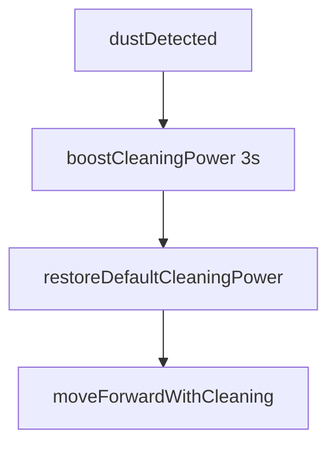
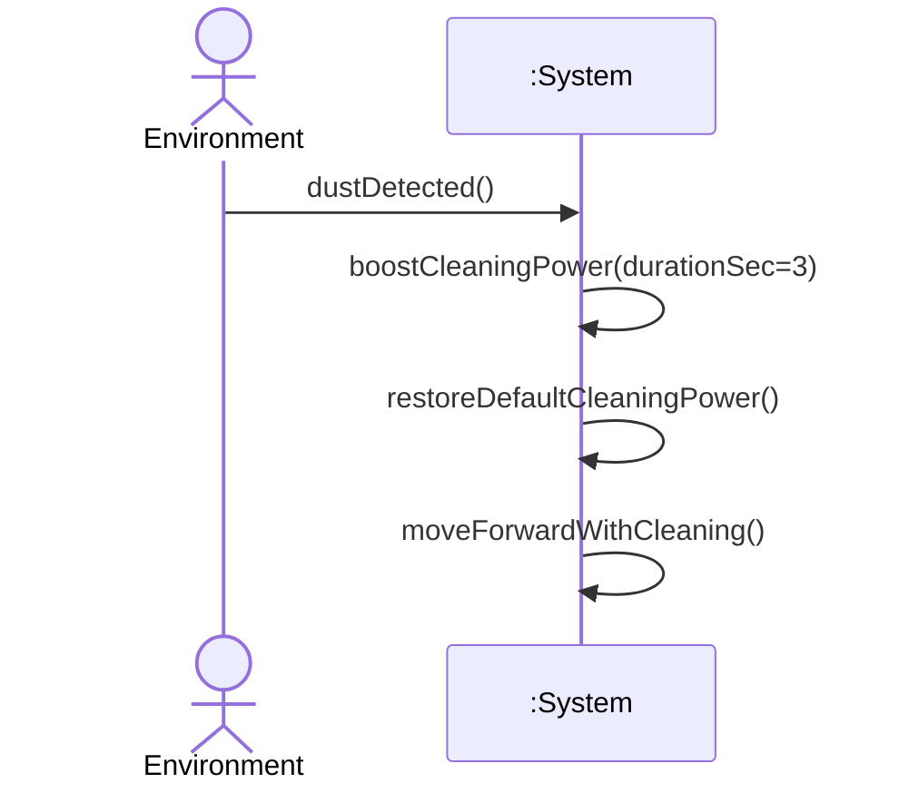

# UC-004 — Dust Boost Cleaning

**목표:** 먼지 감지 시 청소 출력을 3초간 강화한다.

## Actor

| 역할 | Actor | 설명 |
|------|-------|------|
| Primary | Environment | 먼지 존재를 System에 알리는 자극 (black-box, NFR-003) |

## Pre-Requisites

- System이 자동 청소 세션 중이다. (FR-001, NFR-002)
- 전진 청소 중이거나 전진 재개 가능 상태이다. (FR-002, §0.4)

## Typical Courses of Events — UC-004-S01

| # | 행위 / 반응 | FR/NFR |
|---|-------------|--------|
| 1 | Environment가 먼지를 감지·제시한다. | FR-005, NFR-003 |
| 2 | System이 청소 출력을 **3초간** 높인다. | FR-005, UR-003 |
| 3 | 3초 경과 후 System이 청소 출력을 기본 수준으로 되돌린다. | FR-005, NFR-004 |
| 4 | System이 직진 전진 청소를 계속한다. | FR-002, §0.4 |

## Alternative Courses of Events

_(현재 FR 범위 내 별도 분기 없음)_

## Exceptional Courses of Events

_(현재 FR 범위 내 없음)_

## 시나리오 ID 요약

| 시나리오 ID | 설명 | SSD |
|-------------|------|-----|
| UC-004-S01 | 먼지 감지 → 3초 출력 강화 → 기본 복귀 | SSD-UC-004-S01 |

## Postconditions (성공)

- 청소 출력 강화 기간(3초)이 종료되었다.
- System이 직진 전진 청소를 계속한다. (FR-002)

## Mermaid — 분기 요약

---

# SSD-UC-004-S01

- **UC 시나리오:** UC-004-S01
- **Actor:** Environment
- **목적:** 먼지 감지 시 3초 청소 출력 강화

| System Event | System Operation | Parameters | FR/NFR |
|--------------|------------------|------------|--------|
| dustDetected | handleDustDetected | — | FR-005, NFR-003 |
| boostCleaningPower | boostCleaningPower | durationSec=3 | FR-005, UR-003, NFR-004 |
| restoreDefaultCleaningPower | restoreDefaultCleaningPower | — | FR-005, NFR-004 |
| moveForwardWithCleaning | moveForwardWithCleaning | — | FR-002, §0.4 |
