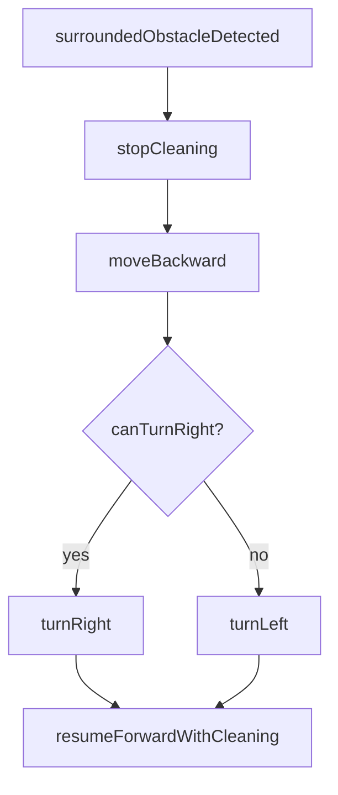
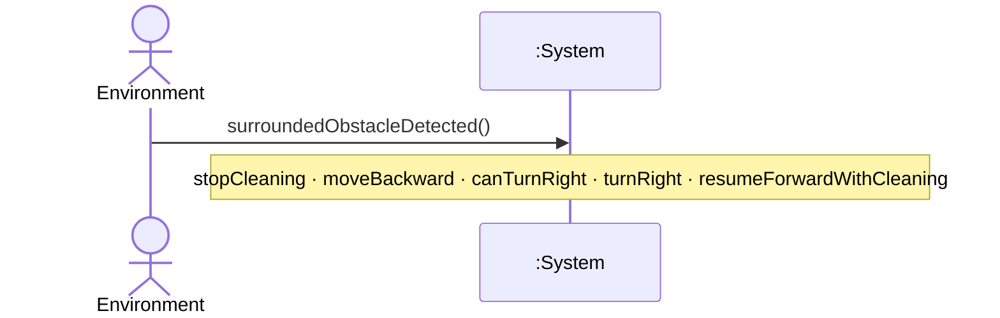
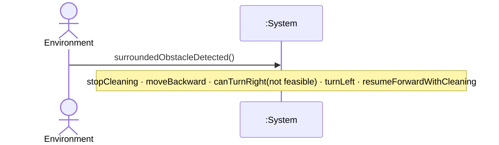

# UC-004 — Recover When Surrounded

**목표:** 전·좌·우가 모두 막혔을 때 후진·회피(우 1차/좌 2차) 후 전진·청소를 재개한다.

## Actor

| 역할 | Actor | 설명 |
|------|-------|------|
| Primary | Environment | 전방·좌측·우측 동시 장애물 자극 (black-box, NFR-003) |

## Pre-Requisites

- UC-001 청소 세션 중이다. (`<<extend>>` via UC-003-S91 또는 직접)
- 전방·좌측·우측 **모두** 장애물이 감지된다. (FR-004)

## Typical Courses of Events — UC-004-S01

**후진 → 우측 회피 → 전진 청소 재개 (UR-001, UR-002)**

| # | 행위 / 반응 | FR/NFR |
|---|-------------|--------|
| 1 | Environment가 전·좌·우 장애물을 제시한다. | FR-004, NFR-003 |
| 2 | System이 청소를 중지한다. | FR-004, NFR-005, §0.4, UR-002 |
| 3 | System이 후진한다. | FR-004, NFR-005, §0.4 |
| 4 | System이 우측 전환 **가능** 여부를 판단한다. | FR-004, NFR-006, UR-001 |
| 5 | System이 우측으로 방향을 전환한다. | FR-004, NFR-006, UR-001 |
| 6 | System이 직진 전진하며 청소·물걸레를 재개한다. | FR-004, NFR-005, §0.4, UR-002 |

## Alternative Courses of Events — UC-004-S02

**후진 → 우측 불가 → 좌측 → 전진 청소 재개**

| # | 행위 / 반응 | FR/NFR |
|---|-------------|--------|
| 1 | Environment가 전·좌·우 장애물을 제시한다. | FR-004, NFR-003 |
| 2 | System이 청소를 중지한다. | FR-004, NFR-005, §0.4 |
| 3 | System이 후진한다. | FR-004, NFR-005, §0.4 |
| 4 | System이 우측 전환 가능 여부를 판단한다 — **불가**. | FR-004, NFR-006, UR-001 |
| 5 | System이 좌측으로 방향을 전환한다. | FR-004, NFR-006, UR-001 |
| 6 | System이 직진 전진하며 청소·물걸레를 재개한다. | FR-004, NFR-005, §0.4, UR-002 |

## Exceptional Courses of Events

_(현재 FR 범위 내 추가 실패 시나리오 없음)_

## 시나리오 ID 요약

| 시나리오 ID | 설명 | SSD |
|-------------|------|-----|
| UC-004-S01 | 후진 → 우측 → 전진 청소 재개 | SSD-UC-004-S01 |
| UC-004-S02 | 후진 → 우측 불가 → 좌측 → 전진 청소 재개 | SSD-UC-004-S02 |

## Postconditions (성공)

- System이 후진·회피를 완료하고 직진 전진 중이다.
- 청소·물걸레가 전진과 함께 재개되었다. (§0.4, UR-002)

## Mermaid — 분기 요약

---

# SSD-UC-004-S01

- **UC 시나리오:** UC-004-S01
- **Actor:** Environment
- **목적:** 후진·우측 회피·전진 청소 재개

| System Event | System Operation | Parameters | FR/NFR |
|--------------|------------------|------------|--------|
| surroundedObstacleDetected | handleSurroundedObstacle | — | FR-004, NFR-003, NFR-006 |
| stopCleaning | stopCleaning | — | FR-004, NFR-005, §0.4 |
| moveBackward | moveBackward | — | FR-004, NFR-005, §0.4 |
| canTurnRight | canTurnRight | — | FR-004, NFR-006, UR-001 |
| turnRight | turnRight | — | FR-004, NFR-006, UR-001 |
| resumeForwardWithCleaning | resumeForwardWithCleaning | — | FR-004, NFR-005, UR-002, §0.4 |

---

# SSD-UC-004-S02

- **UC 시나리오:** UC-004-S02
- **Actor:** Environment
- **목적:** 후진·우측 불가·좌측 회피·전진 청소 재개

| System Event | System Operation | Parameters | FR/NFR |
|--------------|------------------|------------|--------|
| surroundedObstacleDetected | handleSurroundedObstacle | — | FR-004, NFR-003, NFR-006 |
| stopCleaning | stopCleaning | — | FR-004, NFR-005, §0.4 |
| moveBackward | moveBackward | — | FR-004, NFR-005, §0.4 |
| canTurnRight | canTurnRight | result=notFeasible | FR-004, NFR-006, UR-001 |
| turnLeft | turnLeft | fallback=true | FR-004, NFR-006, UR-001 |
| resumeForwardWithCleaning | resumeForwardWithCleaning | — | FR-004, NFR-005, UR-002, §0.4 |
