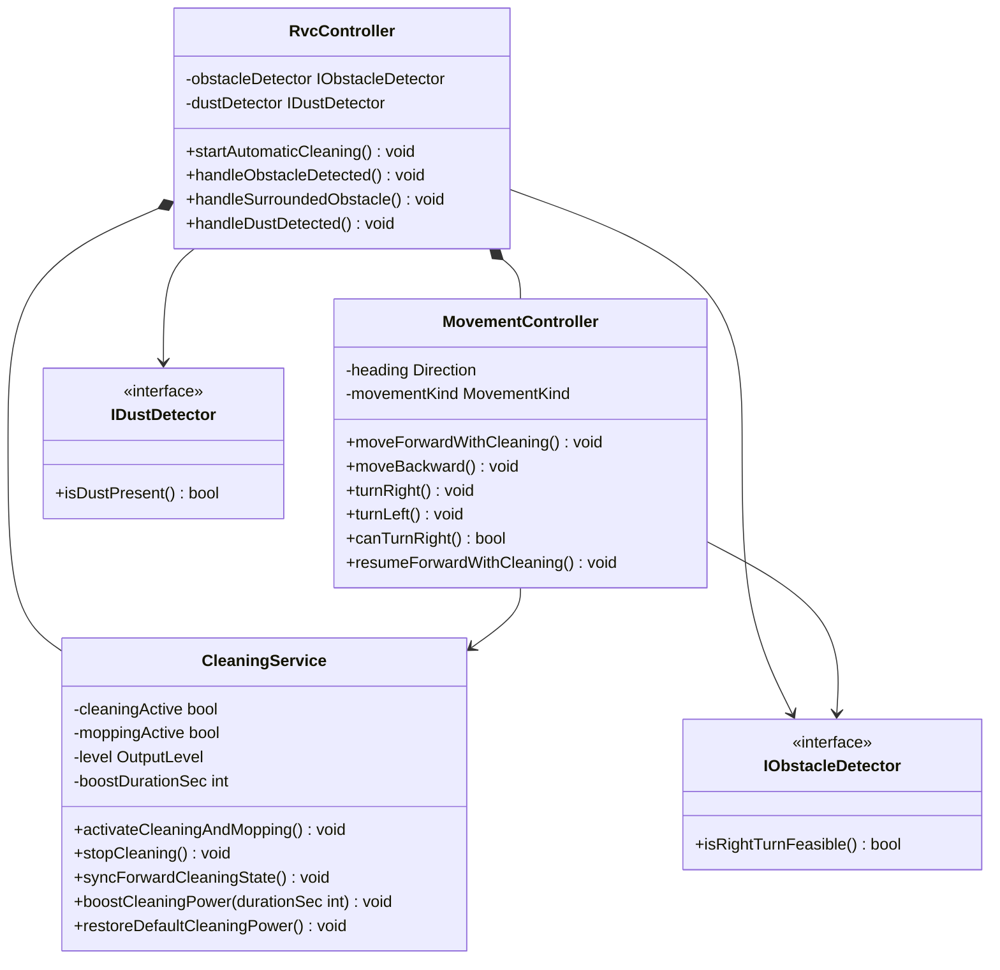

# Design Class Diagram (OOD 1)

## 1. 입력

| 문서 | 경로 |
|------|------|
| Use Case · SSD | `docs/OOA/UseCases/UC-*.md` |
| Domain Model | `docs/OOA/02-Domain-Model.md` |
| SD | `docs/OOD/SD/SD-UC-*-S*.md` |

## 2. 요약

설계 클래스 **3** · interface **2** · operation **18** · SD 시나리오 **8**

| 클래스 / interface | 역할 |
|--------------------|------|
| RvcController | System operation 진입·UC 흐름 조율 (Controller) |
| MovementController | 이동·회전·전진 청소 재개 (SRP) |
| CleaningService | 청소·물걸레·출력 강화 상태 (SRP) |
| IObstacleDetector | 장애물 감지 추상화 (DIP, NFR-003) |
| IDustDetector | 먼지 감지 추상화 (DIP, NFR-003) |

## 3. Domain → Design 매핑

| Domain 개념 | Design 클래스 / interface | 비고 |
|-------------|---------------------------|------|
| RVC | RvcController, MovementController | movementKind·heading → MovementController |
| RVC.cleaningActive, moppingActive | CleaningService | 세션·전진 동기화 |
| CleaningOutput | CleaningService | level, boostDurationSec |
| Obstacle | IObstacleDetector | blocksFront/Left/Right → isRightTurnFeasible |
| Dust | IDustDetector | isDustPresent |
| HouseholdSurface | _(OOI map 표현)_ | OOI 시뮬레이터 Grid — representation gap |

## 4. 설계 클래스 목록

| 클래스 | 책임(SRP) | attribute | operation (시그니처) | 관련 UC/FR |
|--------|-----------|-----------|----------------------|------------|
| **RvcController** | SSD system operation 처리·UC 위임 | -obstacleDetector: IObstacleDetector · -dustDetector: IDustDetector · -movement: MovementController · -cleaning: CleaningService | +startAutomaticCleaning(): void · +handleObstacleDetected(): void · +handleSurroundedObstacle(): void · +handleDustDetected(): void | UC-001–005 · FR-001–005 |
| **MovementController** | 이동·회전·회피 판단 | -heading: Direction · -movementKind: MovementKind | +moveForwardWithCleaning(): void · +moveBackward(): void · +turnRight(): void · +turnLeft(): void · +canTurnRight(): bool · +resumeForwardWithCleaning(): void | UC-002–004 · FR-002–004 · UR-001 |
| **CleaningService** | 청소·물걸레·출력 | -cleaningActive: bool · -moppingActive: bool · -level: OutputLevel · -boostDurationSec: int | +activateCleaningAndMopping(): void · +stopCleaning(): void · +syncForwardCleaningState(): void · +boostCleaningPower(durationSec: int): void · +restoreDefaultCleaningPower(): void | UC-001–005 · FR-001–005 · NFR-004 |

## 5. Interface (DIP / NFR-003)

| interface | operation (시그니처) | 구현 클래스 (OOI) | ISP/DIP 근거 |
|-----------|----------------------|-------------------|--------------|
| **IObstacleDetector** | +isRightTurnFeasible(): bool | ObstacleDetector (OOI) | HW 센서 교체·추가(DEF-001) |
| **IDustDetector** | +isDustPresent(): bool | DustDetector (OOI) | HW 센서 교체·추가(DEF-001) |

## 6. 연관 · 의존

| From | To | 관계 | 설명 |
|------|-----|------|------|
| RvcController | MovementController | composition | SD lifeline move |
| RvcController | CleaningService | composition | SD lifeline clean |
| RvcController | IObstacleDetector | uses | handleObstacle/Surrounded |
| RvcController | IDustDetector | uses | handleDustDetected |
| MovementController | CleaningService | uses | syncForwardCleaningState |
| MovementController | IObstacleDetector | uses | canTurnRight |

## 7. Design Class Diagram

## 8. 변경 이력 (시나리오별)

| SD | 추가/변경 클래스·operation | SOLID(1줄) |
|----|------------------------------|------------|
| SD-UC-001-S01 | RvcController, CleaningService, MovementController core ops | SRP: Controller / Movement / Cleaning 분리 |
| SD-UC-001-S91 | RvcController.+handleObstacleDetected | SRP: 회피 UC 위임 |
| SD-UC-002-S01 | moveForwardWithCleaning, syncForwardCleaningState | §0.4 전진·청소 동기화 |
| SD-UC-003-S01/S02 | stopCleaning, turn*, canTurnRight, IObstacleDetector | DIP: IObstacleDetector |
| SD-UC-003-S91 | handleSurroundedObstacle | extend UC-004 위임 |
| SD-UC-004-S01 | moveBackward | FR-004 후진 |
| SD-UC-005-S01 | boost/restore, IDustDetector, handleDustDetected | DIP: IDustDetector; NFR-004 duration |

## 9. 시나리오 커버리지

| UC 시나리오 | SD 파일 | 신규/갱신 operation |
|-------------|---------|---------------------|
| UC-001-S01 | SD-UC-001-S01.md | startAutomaticCleaning, activateCleaningAndMopping, moveForwardWithCleaning |
| UC-001-S91 | SD-UC-001-S91.md | handleObstacleDetected |
| UC-002-S01 | SD-UC-002-S01.md | moveForwardWithCleaning (include) |
| UC-003-S01 | SD-UC-003-S01.md | stopCleaning, canTurnRight, turnRight, resumeForwardWithCleaning |
| UC-003-S02 | SD-UC-003-S02.md | turnLeft |
| UC-003-S91 | SD-UC-003-S91.md | handleSurroundedObstacle |
| UC-004-S01 | SD-UC-004-S01.md | moveBackward, isSurrounded |
| UC-004-S02 | SD-UC-004-S02.md | (검증) |
| UC-005-S01 | SD-UC-005-S01.md | handleDustDetected, boostCleaningPower, restoreDefaultCleaningPower |
