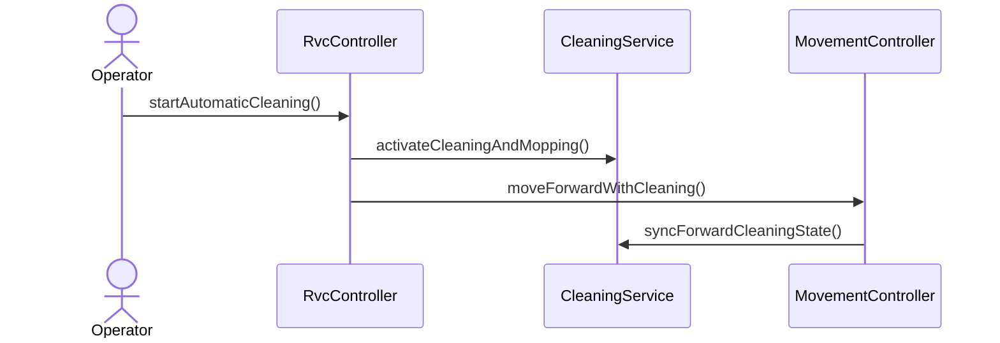

# SD-UC-001-S01

- **UC / SSD:** UC-001-S01 / SSD-UC-001-S01
- **System Operation(주):** startAutomaticCleaning()

## Lifelines → DCD 클래스

| Lifeline | DCD 클래스 | Domain 개념 |
|----------|------------|-------------|
| op | _(Actor)_ Operator | — |
| ctrl | RvcController | RVC |
| clean | CleaningService | CleaningOutput, RVC |
| move | MovementController | RVC |

## Sequence Diagram

## SSD → SD 매핑

| SSD Operation | SD message | To |
|---------------|------------|-----|
| startAutomaticCleaning | startAutomaticCleaning() | RvcController |
| _(include UC-002)_ | activateCleaningAndMopping() | CleaningService |
| moveForwardWithCleaning | moveForwardWithCleaning() | MovementController |
| moveForwardWithCleaning | syncForwardCleaningState() | CleaningService |

## DCD 갱신 (이 시나리오)

| 클래스 | 추가/확정 operation | FR/NFR |
|--------|---------------------|--------|
| RvcController | +startAutomaticCleaning(): void | FR-001 |
| CleaningService | +activateCleaningAndMopping(): void, +syncForwardCleaningState(): void | FR-001, FR-002 |
| MovementController | +moveForwardWithCleaning(): void | FR-002, §0.4 |

## FR/NFR

| ID | 반영 단계 |
|----|-----------|
| FR-001 | activateCleaningAndMopping |
| FR-002, §0.4 | moveForwardWithCleaning, syncForwardCleaningState |
| NFR-002 | startAutomaticCleaning |
