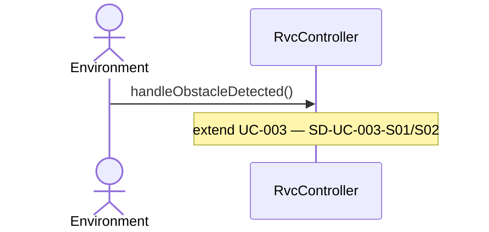

# SD-UC-001-S91

- **UC / SSD:** UC-001-S91 / SSD-UC-001-S91
- **System Operation(주):** handleObstacleDetected()

## Lifelines → DCD 클래스

| Lifeline | DCD 클래스 | Domain 개념 |
|----------|------------|-------------|
| env | _(Actor)_ Environment | — |
| ctrl | RvcController | RVC |

## Sequence Diagram

## SSD → SD 매핑

| SSD Operation | SD message | To |
|---------------|------------|-----|
| obstacleDetected / handleObstacleDetected | handleObstacleDetected() | RvcController |

## DCD 갱신 (이 시나리오)

| 클래스 | 추가/확정 operation | FR/NFR |
|--------|---------------------|--------|
| RvcController | +handleObstacleDetected(): void | FR-003, NFR-003 |

## FR/NFR

| ID | 반영 단계 |
|----|-----------|
| FR-003 | handleObstacleDetected |
| NFR-003 | handleObstacleDetected |
