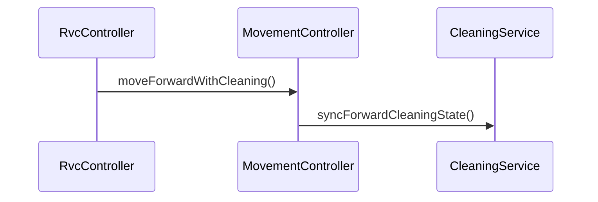

# SD-UC-002-S01

- **UC / SSD:** UC-002-S01 / SSD-UC-002-S01
- **System Operation(주):** moveForwardWithCleaning()
- **Trigger:** `<<include>>` from UC-001 startAutomaticCleaning

## Lifelines → DCD 클래스

| Lifeline | DCD 클래스 | Domain 개념 |
|----------|------------|-------------|
| ctrl | RvcController | RVC |
| move | MovementController | RVC |
| clean | CleaningService | CleaningOutput, RVC |

## Sequence Diagram

## SSD → SD 매핑

| SSD Operation | SD message | To |
|---------------|------------|-----|
| moveForwardWithCleaning | moveForwardWithCleaning() | MovementController |
| moveForwardWithCleaning | syncForwardCleaningState() | CleaningService |

## DCD 갱신 (이 시나리오)

| 클래스 | 추가/확정 operation | FR/NFR |
|--------|---------------------|--------|
| MovementController | +moveForwardWithCleaning(): void | FR-002 |
| CleaningService | +syncForwardCleaningState(): void | FR-002, §0.4 |

## FR/NFR

| ID | 반영 단계 |
|----|-----------|
| FR-002, §0.4 | moveForwardWithCleaning, syncForwardCleaningState |
