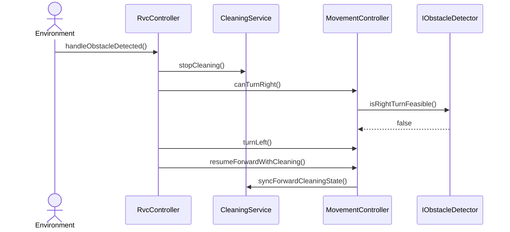

# SD-UC-003-S02

- **UC / SSD:** UC-003-S02 / SSD-UC-003-S02
- **System Operation(주):** handleObstacleDetected()

## Lifelines → DCD 클래스

| Lifeline | DCD 클래스 | Domain 개념 |
|----------|------------|-------------|
| env | Environment | — |
| ctrl | RvcController | RVC |
| clean | CleaningService | CleaningOutput |
| move | MovementController | RVC |
| obs | IObstacleDetector | Obstacle |

## Sequence Diagram

## SSD → SD 매핑

| SSD Operation | SD message | To |
|---------------|------------|-----|
| handleObstacleDetected | handleObstacleDetected() | RvcController |
| stopCleaning | stopCleaning() | CleaningService |
| canTurnRight | canTurnRight() / isRightTurnFeasible() | MovementController / IObstacleDetector |
| turnLeft | turnLeft() | MovementController |
| resumeForwardWithCleaning | resumeForwardWithCleaning(), syncForwardCleaningState() | MovementController / CleaningService |

## DCD 갱신 (이 시나리오)

| 클래스 | 추가/확정 operation | FR/NFR |
|--------|---------------------|--------|
| MovementController | +turnLeft(): void | FR-003, UR-001 |

## FR/NFR

| ID | 반영 단계 |
|----|-----------|
| FR-003, UR-001 | turnLeft (fallback) |
| §0.4 | stopCleaning, resumeForwardWithCleaning |
