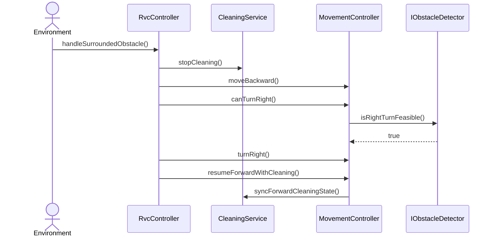

# SD-UC-004-S01

- **UC / SSD:** UC-004-S01 / SSD-UC-004-S01
- **System Operation(주):** handleSurroundedObstacle()

## Lifelines → DCD 클래스

| Lifeline | DCD 클래스 | Domain 개념 |
|----------|------------|-------------|
| env | Environment | — |
| ctrl | RvcController | RVC |
| clean | CleaningService | CleaningOutput |
| move | MovementController | RVC |
| obs | IObstacleDetector | Obstacle |

## Sequence Diagram

## SSD → SD 매핑

| SSD Operation | SD message | To |
|---------------|------------|-----|
| handleSurroundedObstacle | handleSurroundedObstacle() | RvcController |
| stopCleaning | stopCleaning() | CleaningService |
| moveBackward | moveBackward() | MovementController |
| canTurnRight | canTurnRight(), isRightTurnFeasible() | MovementController, IObstacleDetector |
| turnRight | turnRight() | MovementController |
| resumeForwardWithCleaning | resumeForwardWithCleaning(), syncForwardCleaningState() | MovementController, CleaningService |

## DCD 갱신 (이 시나리오)

| 클래스 | 추가/확정 operation | FR/NFR |
|--------|---------------------|--------|
| MovementController | +moveBackward(): void | FR-004, §0.4 |
| IObstacleDetector | +isRightTurnFeasible(): bool | FR-004, NFR-003 |

## FR/NFR

| ID | 반영 단계 |
|----|-----------|
| FR-004, UR-001, UR-002 | stopCleaning, moveBackward, turnRight, resumeForwardWithCleaning |
| §0.4 | stopCleaning, syncForwardCleaningState |
