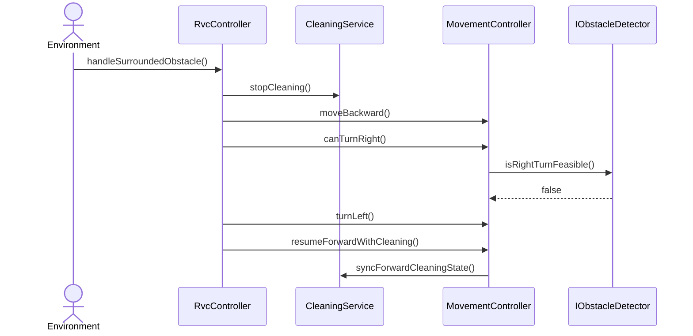

# SD-UC-004-S02

- **UC / SSD:** UC-004-S02 / SSD-UC-004-S02
- **System Operation(주):** handleSurroundedObstacle()

## Lifelines → DCD 클래스

| Lifeline | DCD 클래스 | Domain 개념 |
|----------|------------|-------------|
| env | Environment | — |
| ctrl | RvcController | RVC |
| clean | CleaningService | CleaningOutput |
| move | MovementController | RVC |
| obs | IObstacleDetector | Obstacle |

## Sequence Diagram

## SSD → SD 매핑

| SSD Operation | SD message | To |
|---------------|------------|-----|
| handleSurroundedObstacle | handleSurroundedObstacle() | RvcController |
| stopCleaning | stopCleaning() | CleaningService |
| moveBackward | moveBackward() | MovementController |
| canTurnRight | canTurnRight(), isRightTurnFeasible() | MovementController, IObstacleDetector |
| turnLeft | turnLeft() | MovementController |
| resumeForwardWithCleaning | resumeForwardWithCleaning(), syncForwardCleaningState() | MovementController, CleaningService |

## DCD 갱신 (이 시나리오)

_(operation은 SD-UC-004-S01·003-S02에서 확정 — 시나리오 검증만)_

## FR/NFR

| ID | 반영 단계 |
|----|-----------|
| FR-004, UR-001, UR-002 | turnLeft fallback after backward |
