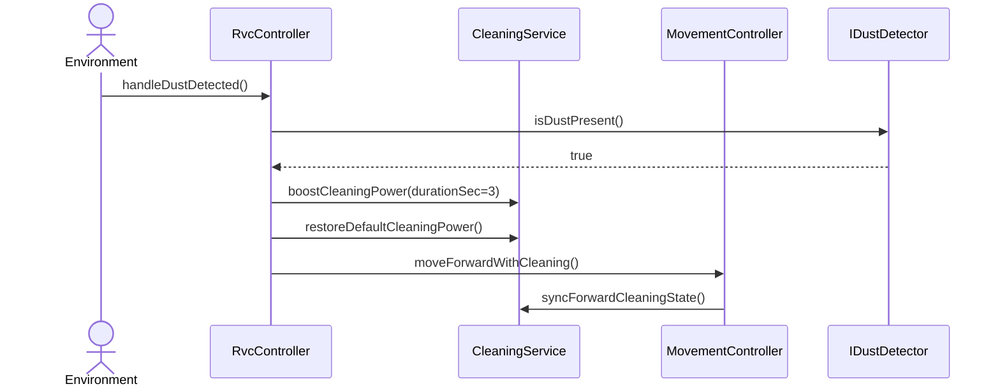

# SD-UC-005-S01

- **UC / SSD:** UC-005-S01 / SSD-UC-005-S01
- **System Operation(주):** handleDustDetected()

## Lifelines → DCD 클래스

| Lifeline | DCD 클래스 | Domain 개념 |
|----------|------------|-------------|
| env | Environment | — |
| ctrl | RvcController | RVC |
| clean | CleaningService | CleaningOutput, Dust |
| move | MovementController | RVC |
| dust | IDustDetector | Dust |

## Sequence Diagram

## SSD → SD 매핑

| SSD Operation | SD message | To |
|---------------|------------|-----|
| handleDustDetected / dustDetected | handleDustDetected() | RvcController |
| _(detect)_ | isDustPresent() | IDustDetector |
| boostCleaningPower | boostCleaningPower(durationSec=3) | CleaningService |
| restoreDefaultCleaningPower | restoreDefaultCleaningPower() | CleaningService |
| moveForwardWithCleaning | moveForwardWithCleaning(), syncForwardCleaningState() | MovementController, CleaningService |

## DCD 갱신 (이 시나리오)

| 클래스 | 추가/확정 operation | FR/NFR |
|--------|---------------------|--------|
| RvcController | +handleDustDetected(): void | FR-005 |
| CleaningService | +boostCleaningPower(durationSec: int): void, +restoreDefaultCleaningPower(): void | FR-005, UR-003, NFR-004 |
| IDustDetector | +isDustPresent(): bool | FR-005, NFR-003 |

## FR/NFR

| ID | 반영 단계 |
|----|-----------|
| FR-005, UR-003 | boostCleaningPower(3) |
| NFR-004 | boostCleaningPower duration, restoreDefaultCleaningPower |
| FR-002, §0.4 | moveForwardWithCleaning after boost |
