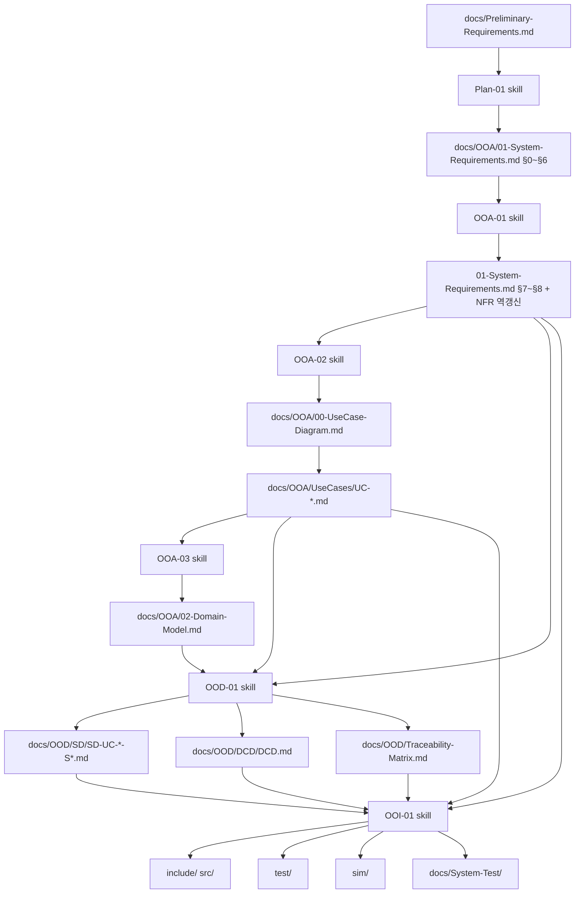

# RVC SW Controller — 문서·산출물 트리

UP Inception → OOA → OOD → OOI 파이프라인과 Cursor skills/rules 대응 관계.

## 파이프라인



## 디렉터리 트리 (목표 구조)

```
docs/
├── Preliminary-Requirements.md      # @ 입력 (원문)
├── README.md                        # 이 문서
├── OOA/
│   ├── 01-System-Requirements.md    # Plan-01 §0~§6 · OOA-01 §7~§8 · FR/NFR/QA/QAS 통합
│   ├── 00-UseCase-Diagram.md        # OOA-02 산출 · Actor·UC·include/extend
│   ├── 02-Domain-Model.md           # OOA-03 산출 · 개념 모델
│   └── UseCases/
│       ├── UC-001.md … UC-005.md    # OOA-02 · UC + SSD(내장)
├── OOD/
│   ├── SD/
│   │   └── SD-UC-###-S##.md         # OOD-01 산출 · 내부 협력
│   ├── DCD/
│   │   └── DCD.md                   # OOD-01 산출 · 설계 클래스
│   └── Traceability-Matrix.md       # OOD-01 산출 · UC→코드 추적
└── System-Test/                     # OOI-01 산출
    ├── Capability-Catalog.md
    └── Scenarios.md

include/                             # OOI-01 · C++ 헤더
src/                                 # OOI-01 · C++ 구현
test/                                # OOI-01 · gtest (WSL)
sim/                                 # OOI-01 · GUI 시뮬레이터
CMakeLists.txt
```

## Skill · Rule 매핑

| 단계 | Skill | 주요 산출 | Rule |
|------|-------|-----------|------|
| Plan | `Plan-01-System-Requirements` | `01-System-Requirements.md` §0~§6 (FR·NFR·ISO 25010) | — |
| OOA | `OOA-01-Quality-Attribute-Scenarios` | 동일 파일 §7~§8 (QA·QAS)·NFR 역참조 | — |
| OOA | `OOA-02-UseCases` | `00-UseCase-Diagram.md`, `UseCases/UC-*.md` | — |
| OOA | `OOA-03-Domain-Model` | `02-Domain-Model.md` | — |
| OOD | `OOD-01-Sequence-Class` | `SD/`, `DCD/`, `Traceability-Matrix.md` | — |
| OOI | `OOI-01-Implementation` | `include/`, `src/`, `test/`, `sim/` | `cpp-impl`, `testing`, `gtest-framework` |

## 경로 규칙 (통일)

- System Requirements (FR·NFR·QA·QAS 통합): **`docs/OOA/01-System-Requirements.md`**
  - §0~§6: Plan-01 · §7~§8: OOA-01
- Domain Model: **`docs/OOA/02-Domain-Model.md`**
- Use Case Diagram: **`docs/OOA/00-UseCase-Diagram.md`**
- Use Case·SSD: **`docs/OOA/UseCases/UC-001` … `UC-005`** (SSD는 UC 파일 내 섹션)
- 대소문자·디렉터리명은 위 트리와 동일하게 유지

## 시작 방법

1. `@docs/Preliminary-Requirements.md` + **Plan-01** → FR·NFR (ISO 25010 품질속성 포함, §0~§6)
2. **OOA-01** → 동일 `01-System-Requirements.md`에 QA·QAS·다이어그램 (§7~§8, NFR 역갱신)
3. **OOA-02** → Use Case Diagram · UC·SSD
4. **OOA-03** → Domain Model
5. **OOD-01** → SD·DCD·Traceability
6. **OOI-01** → C++ 구현·gtest(WSL)·GUI System test
